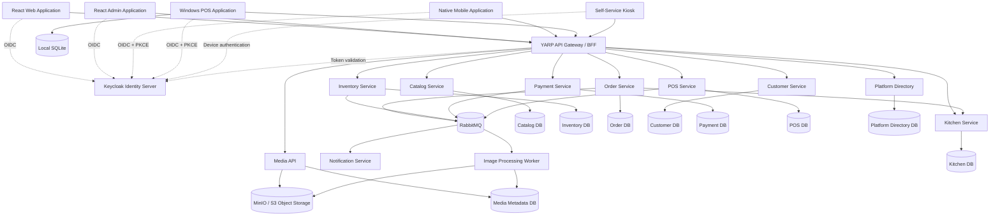

# NexaConnect Project Architecture

The [five-scenario hosted Omise test-account gate passed on 2026-09-18](../../docs/Architecture/Evidence/Omise-Five-Scenario-Recovery-Acceptance.md), including pre-authorization token handoff. Payment implements opt-in signed test webhooks with migration-8 durable event-ID ingestion, authenticated canonical event validation and lease-fenced status-only recovery. The guarded real external-delivery/process-interruption gate [passed on 2026-09-22](../../docs/Architecture/Evidence/Omise-Webhook-Recovery-Acceptance.md), including post-commit/pre-acknowledgement termination, expired-lease restart and signed duplicate replay. Production enablement remains open. [ADR-010](../../docs/Architecture/Decisions/ADR-010-verified-omise-webhook-recovery.md) records the trade-offs. See [configuration, failure recovery and live acceptance](../../docs/Deployment/Omise-Webhooks.md).

A read-only POS Omise acceptance verifier now checks one Paid test-card Order, one amount/ownership-matched captured intent with single authorization/capture starts, an operator-supplied closed shift and cleared local credentials/recovery. UI/OIDC steps require explicit operator confirmation; the verifier does not certify remote charge status or process interruption. [Local POS Omise verification passed on 2026-09-18](../../docs/Architecture/Evidence/Omise-POS-Card-Acceptance.md) with operator-attested UI/OIDC/sign-out; those interactions are not independently inspected. See the [card-checkout verification procedure](../../docs/Deployment/Omise-POS-Card-Token-Handoff.md).


Opt-in Development-only `card_omise_test` checkout now forwards a masked, transient test token from POS to Order and Payment. Pending intents without a token await a fresh operator token; retries use the original Order identity and contents. For an original pending checkout, POS enables token input only after Verify original order returns validated `cardTokenRequired=true`; that permission is memory-only and cleared on each attempt/session lock. Tokens never enter SQLite/outbox or durable workflow state. The opt-in five-scenario hosted Omise gate passed on 2026-09-18, including pre-authorization/token handoff. Local POS Omise verification passed on 2026-09-18 with operator-attested UI/OIDC/sign-out; the verifier does not independently inspect those interactions. Production browser card collection remains planned. [ADR-009](../../docs/Architecture/Decisions/ADR-009-ephemeral-test-card-token-handoff.md) records transient-token and explicit-recovery trade-offs. See the [configuration and acceptance guide](../../docs/Deployment/Omise-POS-Card-Token-Handoff.md).

Omise hosted recovery acceptance now reuses the generated PostgreSQL/RabbitMQ harness with four fresh-token response-interruption scenarios and real Order/Payment hosts. Tokens are confined to initial acceptance authorization and stripped from service host environments; normal TLS, status-only uncertainty recovery and lease guards remain enforced. Four-scenario credentialed hosted Omise acceptance passed on 2026-09-17; the opt-in five-scenario pre-authorization/token-handoff gate passed on 2026-09-18. See [hosted guide](../../docs/Deployment/Omise-Hosted-Recovery-Acceptance.md).


See [retained four-scenario hosted Omise evidence](../../docs/Architecture/Evidence/Omise-Hosted-Recovery-Acceptance.md) for the exact pass and exclusions.

Omise capture diagnostics now include `scripts/inspect-omise-test-charge.ps1`: hidden input selects an existing test charge, a single read-only GET reports nullable flags/minor-unit amounts without identifiers, and no financial or local-state mutation occurs. The Paid-charge inspection identified omitted captured_amount. New authorizations retain signed full-capture request context, allowing strictly verified paid responses that omit both capture fields while preserving unknown raw values and partial/refund protection. See [ADR-008](../../docs/Architecture/Decisions/ADR-008-omise-full-capture-context.md) for request provenance and credential-rotation trade-offs. Existing unmarked charges remain unconfirmed; the direct Omise test-account gate passed on 2026-09-17, including trusted full-capture context; four-scenario hosted Omise acceptance passed on 2026-09-17; the subsequent pre-authorization/token-handoff gate passed on 2026-09-18; see the [Omise acceptance guide](../../docs/Deployment/Omise-Test-Account-Acceptance.md#inspect-an-existing-charge-without-another-payment).

A Development-only local HTTPS Omise token helper is available at `src/Tools/NexaConnect.OmiseTokenHelper`. It uses official browser tokenization with the operator's test public key and a fixed test card, keeps tokens out of server requests and logs, and replaces the documentation demo for acceptance preparation. Trusted development HTTPS is required; direct credentialed Omise acceptance passed on 2026-09-17; Development-only POS/Order test-token handoff is implemented; local POS verification passed on 2026-09-18 with operator-attested UI/OIDC; independent proof of UI interaction and production card collection remain outside this pass. See the [Omise acceptance guide](../../docs/Deployment/Omise-Test-Account-Acceptance.md).

Payment now includes an Omise test-only THB card adapter, ephemeral internal authorization input and metadata-bound lost-response recovery. It reuses existing leases/audit/outbox/workers without a migration. Direct Omise credentialed acceptance passed on 2026-09-17. Hosted Omise interruption acceptance, POS token handoff, 3DS, PromptPay and production onboarding remain open. See [Omise acceptance](../../docs/Deployment/Omise-Test-Account-Acceptance.md).

The provider recovery gate now includes hosted pre-capture void recovery, duplicate delivery and paid-Order protection. Its five-scenario local hosted acceptance passed on 2026-09-17, including duplicate void delivery and cleanup; four-scenario hosted Omise execution passed on 2026-09-17; five-scenario Omise pre-authorization acceptance passed on 2026-09-18; production acceptance remains open. See [recovery scope, evidence and remaining release gates](../../docs/Architecture/Evidence/Phase-10-Order-Workflow-Recovery.md).

The provider recovery acceptance broker now includes a separate durable `payment.#` evidence queue, a project-owned restart-persistent RabbitMQ volume, and one stable random loopback port. It permits mandatory terminal/lifecycle publication and verifies the exact terminal event's persistent delivery after broker/Payment restart; Order reconciliation still completes through its own real inbox. Project cleanup removes the volume. This changes acceptance topology only, with no product ownership or deployed routing change.

`NexaConnect.PaymentProviderSimulator` is a test-only in-memory loopback HTTPS provider fixture. `scripts/test-order-provider-recovery-local.ps1` generates credentials/certificate and drives the real hosted Order/Payment recovery matrix without an external sandbox. Payment's optional simulator SHA256 pin is restricted to Testing and IPv4 loopback HTTPS; default/deployed TLS validation and business ownership are unchanged. The complete local hosted matrix passed on 2026-09-16 with three provider-boundary interruptions, three Payment-host interruptions and cleanup; four-scenario hosted Omise acceptance passed on 2026-09-17; five-scenario Omise pre-authorization acceptance passed on 2026-09-18; production acceptance remains a gate.

Order now propagates organization/application context for Inventory reservation and release, selecting tenant-scoped persistence for these workload calls. Inventory dependency failures remain sanitized transport failures; matching terminal checkout rejection releases the POS recovery lock. Service ownership and database schemas are unchanged.

The WPF POS separates Checkout, Payment, Shift & cash, Cash review, and Terminal & sync. Its public-client PKCE session silently rotates short-lived credentials during activity, locks after five minutes without operator input, and forces interactive authentication at idle or the ten-hour absolute boundary while retaining operational recovery. Shift & cash reads PostgreSQL-authoritative cashier/terminal reconciliation and closes against its reviewed version. POS migration 5 adds a current cash-review projection and append-only supervisor history; Authorization migration 7 grants tenant administrators/store managers read and resolve access and accountants read only. Exact-store lists use stable cursor paging, decisions are idempotent and fenced by financial/review versions, and late cash movements atomically recalculate expected cash and variance before superseding older review. Review reads derive expected cash from authoritative movements so legacy closed sessions with a missing or stale stored expected amount remain consistent. Terminal-bound SQLite schema 2 persists the exact supervisor request, scope, reason, and financial/review versions before network send; restart restores the locked request for verification and history reconciliation. The guarded joined cashier acceptance passed on 2026-09-10, and the guarded local human Cash Review workflow passed on 2026-09-15 with restart recovery, stale-client conflict, and late-settlement invalidation. Order migrations 6-7 recover interrupted manual and provider checkout workflows. Provider recovery uses the stable `order:{orderId}` Payment idempotency key, reads existing intent state before continuing, never replays an in-progress or uncertain authorization/capture, and routes exhausted uncertainty into Payment Review through the durable reconciliation consumer. Its guarded five-scenario runner now starts real Order and Payment hosts, stops RabbitMQ before hosted Payment recovery, proves terminal state and an unpublished transactional-outbox event commit together, kills and restarts Payment, and verifies publication plus matching Order inbox completion. The complete local hosted matrix passed on 2026-09-16 after correcting the evidence subscription and RabbitMQ restart persistence; four-scenario hosted Omise acceptance passed on 2026-09-17; five-scenario Omise pre-authorization acceptance passed on 2026-09-18; production acceptance remains a release gate. Fresh physical-terminal session-lock and supervisor acceptance, multi-store views, exports and production cash-close Reporting acceptance, offline supervisor authorization/execution, and broader synchronization remain open. See the [POS cashier acceptance guide](../../docs/Deployment/POS-Cashier-Acceptance.md).

POS manual-tender hardening includes hosted RabbitMQ recovery/dead-letter acceptance, a guarded PowerShell evidence runner, correlated telemetry, and Prometheus backlog/dead-letter/retry rules. The disposable live matrix passed 3/3 on 2026-09-03 UTC with sanitized evidence.

The Bangkok manual-tender path uses Order 5-6, Authorization 6, Reporting 14, and POS 4. The WPF client supports explicit cash/PromptPay Paid confirmation, local recovery of the stable settlement idempotency identity, configured local PromptPay QR display, and uncertainty verification through identical replay. Order persists the original payment method and correlation ID and uses a claim/lease worker to replay Inventory and Kitchen steps idempotently after an interruption. The optional POS consumer validates the event-time shift/session and projects each Order once. Cash posts to that THB session and can reconcile it after close; PromptPay never changes drawer totals. The upgraded SQLite protected-client/PostgreSQL/RabbitMQ/migration runner passed 17/17 on 2026-09-10. Joined SQLite-backed local OIDC/WPF cash checkout and sign-out subsequently passed on the same date.

Payment Review acceptance has a generated PostgreSQL/RabbitMQ/alert operations project whose 13-case matrix passed locally, plus a joined PostgreSQL/Keycloak/RabbitMQ/Toxiproxy project. The joined launcher provisions accounts and eight fixtures, starts seven loopback application hosts, routes Order-to-Inventory through the isolated proxy, supervises disposable Inventory/Kitchen process faults, requires 10/10 real-OIDC browser scenarios, and verifies process/Compose cleanup. The joined run passed locally on 2026-09-02. Provider evidence, production paging, and live-traffic rollback remain open. See `docs/Deployment/Payment-Review-Release-Checklist.md`.

`NexaConnect.PaymentReviewAcceptance` provisions joined-browser data through Platform Directory, Restaurant, Authorization, and Order-owned Application/Infrastructure boundaries. The joined launcher owns a generated PostgreSQL/Keycloak/RabbitMQ/Toxiproxy project, applies four migrations, creates disposable users and marked fixtures, starts seven loopback application hosts, wires a run-scoped Order-to-Inventory proxy, runs token-protected Inventory/Kitchen process faults, requires the ten-scenario Playwright suite, and cleans up exact processes and Compose resources. Exact run-scoped database names and bounded service probes reject detected fixture state before writes. Local 10/10 joined evidence passed on 2026-09-02; production provider, paging, and rollback rehearsals remain gates.

Payment Review local acceptance sign-off passed 8/8 on 2026-08-31: HTTP tenant/permission/concurrency and attribution checks, live PostgreSQL competing-claim/expired-lease fencing, and a Reporting duplicate-acknowledgement barrier. See `docs/Architecture/Evidence/Phase-11-Payment-Review-Live-Verification.md` for evidence boundaries and retained TRX. This is not production readiness certification.

Portal roadmap status: Phases 1-4, 6, and 7 are complete for their documented development scope; Phase 5 BFF hardening and the Phase 8 Customer Portal and Phase 9 Media functional slices are implemented. An opt-in Playwright harness joins the authenticated Customer Portal and Media lifecycle, but environment-specific execution, recovery, load, security validation, and production operational hardening remain release gates. Phase 10 product integration is partial, Phase 11 testing is continuous, and Phase 12 has a development foundation with production hardening planned.

Inventory Phase 10 publication is implemented for tenant-scoped stock set, reservation create, and release: those PostgreSQL mutations commit versioned integration events and safe audit state through the migration-1 outbox and migration-5 reservation-identity/audit boundary. Trusted unscoped PostgreSQL paths remain legacy/non-publishing. A transaction-scoped organization/order lock makes concurrent active-order retries return the persisted reservation identity without double-decrementing stock. All seven opt-in acceptances passed locally against PostgreSQL 17 and RabbitMQ, including confirmed persistent publication of all three events and the actual migration runner's 0→5→4→5 lifecycle. The broker case uses a new recovery connection and does not prove established-dispatcher reconnection. The Inventory Phase 10 slice is closed.

Payment authorization, capture, and pre-capture void recovery distinguish definitive outcomes from uncertainty. Order 5 owns Bangkok manual settlement, Authorization 6 and Reporting 14 own permission/audit vocabulary, POS 4 consumes the safe event idempotently, and the WPF Paid control is implemented. Joined client-to-service verification, provider-specific live evidence, refunds, and settlement remain planned.

Payment capture and void recovery use provider status lookup, recoverable leases, bounded background reconciliation, transactional versioned events, and durable Order consumption. Void/reversal accepts only trusted Order calls for authorized, uncaptured intents, uses a stable provider idempotency key, separates failed from uncertain outcomes, and rejects captured intents. Order migration 3 persists organization/payment-intent ownership, consumes void outcomes, and emits `order.payment-review-required.v1` when operator review is required. Downstream compensation remains retry-at-least-once and therefore depends on Inventory/Kitchen idempotency by order identity. Live broker replay, refunds, compensation-policy expansion, and end-of-day settlement remain planned.

Payment migration 7 makes void/reversal durable with PostgreSQL leases, bounded status reconciliation, sanitized provider references, transactional lifecycle/audit outbox publication, and guarded downgrade. Reporting migration 12 accepts the vocabulary. Order migration 3 consumes void events through the existing durable inbox: confirmed void compensates unpaid Inventory/Kitchen work, uncertainty retains it, failure/exhaustion enters `payment_review`, and paid orders are immutable. Local PostgreSQL tests passed Payment `0→7→6→7` and Order `0→3→2→3`. Local RabbitMQ void replay passed on 2026-09-17; dedicated telemetry/alerts, concrete-provider evidence, refunds, and settlement remain open.

Payment review resolution is implemented through Order migration 4, Authorization migration 5, and Reporting migration 13. Authorization provisioning gives tenant administrators and store managers read/resolve access even when their roles are created after migrations, while branch-scoped accountants receive read only; migration 5 backfills existing accountant roles. Organization/branch-scoped operators use dedicated permissions and a two-minute fenced decision lease to confirm void, resume payment reconciliation, or append an escalation while retaining review. Claims advance concurrency and retain the Authorization decision ID; expired takeover is allowed only for the same resolution. PostgreSQL commits the Order transition, append-only review history, versioned resolution event, and safe audit atomically. Open-case count/age gauges and a stale-review rule are checked in. The acceptance matrix covers Order `0→4→3→4`, Reporting-13 projection removal/replay, repository-produced review/audit contracts through a failed then restarted hosted dispatcher with confirmed RabbitMQ publication, and hosted Reporting duplicate suppression. The Customer Portal now provides tenant-revalidated, CSRF-protected branch review/history and explicitly confirmed decisions with conflict refresh, via the Customer BFF. It reads the latest 100 committed Order history entries without a schema change. Branch UUID entry avoids organization-wide branch-list privileges. Joined live operator/identity-provider acceptance, a successful run against each verified release target, concrete production paging/acknowledgement, and threshold calibration remain follow-up work. See `docs/API/Payment-Review-Operator-UI.md`.

Kitchen ticket lifecycle now enforces queued/in-progress/ready/completed/cancelled invariants, exact Order workload creation/compensation, dedicated Kitchen workload authorization-scope lookup, migration-backed operator permissions, tenant-authorized operator reads/transitions, conflict-safe station snapshots, organization-leading PostgreSQL, append-only history/audit, and transactional Kitchen lifecycle/audit events. Reporting migration 5 provides compatible projection and replay. Five coordinated acceptances passed against PostgreSQL 17 and RabbitMQ, including multi-station creation and the actual 0→3→2→3 runner lifecycle. The ticket-lifecycle Phase 10 slice is closed; the online operator queue is implemented with joined live acceptance still open. Item-level preparation, dedicated KDS hardware and offline workflows remain planned.

Customer profile creation now uses Domain validation, tenant-only authorization, organization-leading conflict-safe replay, append-only audit that excludes profile fields, and transactional `customer.profile-created.v1`/`customer.audit.v1` publication through the migration-1 outbox. Customer migration 2 owns audit objects and Reporting migration 6 owns compatible projection/replay vocabulary. Six coordinated PostgreSQL 17/RabbitMQ acceptances passed locally, including concurrent replay, atomic rollback, confirmed publication, Reporting replay, and the actual 0→2→1→2 runner. The creation slice is closed; profile status transitions and detailed customer data workflows remain planned.

POS cash-movement replay has successful live PostgreSQL 17 evidence for exact/concurrent idempotency, rollback, terminal/subject denial, active scope, and shift concurrency. POS migration 4 owns the immutable manual-tender projection; migration 5 owns review state/history and refuses downgrade after review data exists. The POS migration lifecycle exercises `0→5→4→3→5` and the post-review guard. Terminal-bound SQLite recovery, version-fenced cashier reconciliation, and online supervisor review have focused Application, HTTP, client, migration, and live PostgreSQL coverage. Guarded local human supervisor acceptance passed on 2026-09-15. Order migration 6 adds fenced recovery of Submitted and InventoryReserved manual-tender workflows; its guarded real-host acceptance passed two process interruptions, dependency retry, correlation propagation, duplicate-transition checks, and final cash settlement on 2026-09-15. Order migration 7 expands the recovery index and worker through provider payment, with state-aware authorization/capture resumption and PaymentPending/PaymentReview handoff. Its migration acceptance exercises `0→7→6→7`. The concrete-provider interruption harness is implemented and awaits sandbox execution. Physical-terminal supervisor/session-policy acceptance, multi-store review, exports and production cash-close Reporting acceptance, and broader synchronization remain open.

Phase 4 tenant-API status: Platform Directory resolves authenticated membership and enabled product access; Catalog, Inventory, Order, Kitchen, Payment, and Customer enforce product-owned permission decisions and resource ownership before their customer use cases execute. Catalog and Inventory customer persistence paths use organization-leading predicates and composite tenant keys; portals remain database-free.

Phase 10 Catalog status: PostgreSQL menu-item upserts now transactionally persist an append-only product audit record plus versioned menu-change and audit outbox messages. The shared RabbitMQ dispatcher is opt-in. Migration 1 owns the outbox and durable publication history; migration 4 owns the audit objects and its downgrade preserves the outbox.

Phase 11 now includes opt-in live PostgreSQL atomic commit/rollback, append-only audit enforcement, retry state, and migration 4 downgrade/re-upgrade. Real RabbitMQ acceptance verifies an unreachable connection attempt, a Catalog commit made without a broker connection, and later publication over a new real connection with publisher confirms, persistent messages, isolated consumption, and publication timestamps. It does not exercise reconnection of an established dispatcher connection. The Catalog Phase 10 slice is closed; a successful production-like run of the full migration 1-4 acceptance remains a release gate.

The Catalog full-database migration-runner acceptance is implemented for 0→4→3→4 with checksum/history, schema, and real repository verification. It also corrected migration ownership: version 1 owns `outbox_messages`, while version 4 owns only append-only Catalog audit objects and preserves the outbox on downgrade. It has not run successfully in the current local environment because the configured PostgreSQL administrator password is stale and the service migration identity correctly lacks `CREATEDB`; no role or password was changed.

## 1. Purpose

NexaConnect is a restaurant operating platform that supports staff POS terminals, touch-screen self-service kiosks, kitchen ordering and display, customer QR ordering, reporting, and external integrations. Restaurant branches must continue approved operations during internet or cloud outages and synchronize safely after recovery. The architecture separates business capabilities into independently maintainable services while keeping the initial implementation practical for a small team.

Current implementation status: the repository provides solution scaffolding, JWT validation, local identity/infrastructure configuration, schema-first PostgreSQL tooling, Platform Directory organization-access and current-tenant access contracts, separate Customer and Platform Admin BFF session boundaries with required production Redis ticket storage, distinct platform/customer/product role sets, independently approved and time-limited support elevation with append-only audit history, PostgreSQL-backed Platform Directory and POS slices, POS cash-movement replay dedupe through terminal-scoped `sync_operations`, PostgreSQL adapters for Catalog, Inventory, Kitchen, Customer, Payment, and Notification, migration-managed service projections, durable PostgreSQL/RabbitMQ outbox and inbox primitives, PostgreSQL aggregate/idempotency persistence for Order, Keycloak client-credentials outbound authentication with retries, payment-failure compensation hooks, durable Notification provider submission/receipt reconciliation, provider retry boundaries, a public place-order workflow endpoint, executable bounded-context API slices, and cross-service HTTP coverage for the Catalog -> Order -> Inventory -> Kitchen -> Payment workflow. Catalog, Order, Inventory, Kitchen, Customer, Payment, and Notification enforce their implemented customer-facing authorization and ownership boundaries. Concrete production provider acceptance, offline synchronization beyond the implemented POS cash-movement replay path, and authorization for remaining product resources remain planned.

The centralized observability foundation supplies structured JSON console logs, validated correlation identifiers, safe request logs, and optional OTLP signals. The Customer BFF, tenant services, and POS propagate correlation identifiers across their registered HTTP dependency chains; Platform Directory and Platform Admin BFF also adopt the foundation. Locally, logs are retained in Loki, service metrics are retained and rules evaluated in Prometheus, resulting alerts are routed by Alertmanager, RabbitMQ exposes queue metrics to Prometheus, Grafana provisions both sources, and traces remain debug-only. Payment adds separate anonymous liveness/readiness endpoints plus capture/outbox backlog-age telemetry; Order adds reconciliation-inbox/outbox backlog-age telemetry. PostgreSQL readiness requires Payment migration 7 and deliberately excludes provider availability. Local Alertmanager has no external notification receiver. New implementations must include observability and redaction verification. Production ingestion security, durable storage, retention, access hardening, alert delivery, and a trace backend remain required. See [ADR-007](../../docs/Architecture/Decisions/ADR-007-centralized-observability-foundation.md).

The detailed restaurant domains, branch-edge topology, offline failure model, kitchen flow, QR behavior, reporting architecture, and shared identity boundary are defined in [`docs/Architecture/Restaurant-POS-Architecture.md`](../../docs/Architecture/Restaurant-POS-Architecture.md). This document summarizes the supporting project architecture.

## 2. Architectural principles

1. **Business capability boundaries** — services are organized by domain responsibility rather than technical layer.
2. **Independent data ownership** — each service owns its schema or database and other services do not update its tables directly.
3. **API-first integration** — synchronous communication uses versioned HTTP APIs; asynchronous state changes use integration events.
4. **Centralized identity** — Keycloak provides OpenID Connect and OAuth 2.0 authentication.
5. **Defense in depth** — authentication occurs centrally, while resource-level authorization remains inside each business service.
6. **Observable by default** — logging, traces, metrics, and health checks are included from the beginning.
7. **Offline-aware POS** — the Windows POS client uses local storage and reliable synchronization.
8. **Incremental microservices** — avoid splitting services until a clear deployment, scaling, ownership, or reliability requirement exists.
9. **Branch resilience** — restaurant ordering, kitchen routing, cash payment, and receipt printing must not depend on continuous WAN connectivity.
10. **One order lifecycle** — POS, waiter, kiosk, and customer QR channels converge into the same Ordering capability.
11. **Reporting projections** — reporting consumes business events and never becomes a cross-service transactional query layer.
12. **Domain-driven design** — bounded contexts own their language, models, persistence, and integration contracts; tactical patterns are applied where business complexity justifies them.

## 3. High-level architecture



## 4. Solution structure

```text
NexaConnect/
├── docs/
│   ├── Architecture/
│   ├── API/
│   ├── Database/
│   └── Deployment/
├── docker/
│   ├── keycloak/
│   ├── postgres/
│   ├── redis/
│   ├── rabbitmq/
│   ├── prometheus/
│   └── grafana/
├── scripts/
├── src/
│   ├── Aspire/
│   │   ├── NexaConnect.AppHost/
│   │   └── NexaConnect.ServiceDefaults/
│   ├── BuildingBlocks/
│   │   ├── NexaConnect.BuildingBlocks/
│   │   ├── NexaConnect.Contracts/
│   │   ├── NexaConnect.Infrastructure/
│   │   └── NexaConnect.Shared/
│   ├── Gateway/
│   │   └── NexaConnect.Gateway/
│   ├── Tools/
│   │   ├── NexaConnect.DataMigration/
│   │   └── NexaConnect.DataGeneration/
│   ├── Services/
│   │   ├── NexaConnect.Services.Catalog/
│   │   ├── NexaConnect.Services.PlatformDirectory/
│   │   ├── NexaConnect.Services.Inventory/
│   │   ├── NexaConnect.Services.Order/
│   │   ├── NexaConnect.Services.Customer/
│   │   ├── NexaConnect.Services.Payment/
│   │   ├── NexaConnect.Services.Notification/
│   │   └── NexaConnect.Services.POS/
│   └── Clients/
│       ├── NexaConnect.Web/
│       ├── NexaConnect.Admin/
│       ├── NexaConnect.Mobile/
│       └── NexaConnect.POS/
└── tests/
    ├── Unit/
    ├── Integration/
    └── Architecture/
```

## 5. Component responsibilities

### 5.1 API Gateway

`NexaConnect.Gateway` is the public entry point for application clients. It uses YARP for routing and can implement client-specific Backend-for-Frontend endpoints.

Responsibilities:

- Validate access tokens.
- Route requests to internal services.
- Apply rate limits and request-size limits. Payment's outbound provider adapter already treats provider HTTP 429 as an uncertain financial outcome and requires reconciliation; inbound and other service limits remain planned.
- Add correlation identifiers.
- Aggregate selected responses when justified.
- Hide internal service addresses.

The gateway must not contain core business rules.

### 5.2 Keycloak

Keycloak is deployed as a separate, shared identity platform rather than as an ASP.NET Core project. NexaConnect and other products integrate through OpenID Connect and OAuth 2.0 using separate clients and resource scopes; they do not share application authorization tables.

Shared organization and membership data is owned by a Platform Directory capability and distributed through versioned APIs and events. Products never query shared physical platform tables. This boundary is defined by [`ADR-002`](../../docs/Architecture/Decisions/ADR-002-shared-platform-data-ownership.md).

Recommended clients:

- `nexaconnect-web-bff` — confidential client.
- `nexaconnect-admin-bff` — confidential client.
- `platform-admin-bff` — separately deployed shared-platform dashboard client, owned outside NexaConnect.
- `nexaconnect-mobile` — public client using Authorization Code with PKCE.
- `nexaconnect-pos` — public client using Authorization Code with PKCE and an explicit stable-subject access-token mapper.
- One confidential service account per machine-to-machine workload.

Implemented platform roles:

- `platform-owner`
- `platform-admin`
- `platform-support`
- `platform-auditor`

Implemented customer roles:

- `customer-owner`
- `customer-admin`
- `customer-manager`
- `customer-user`
- `customer-viewer`

Product-specific realm roles remain separate:

- `tenant-admin`
- `store-manager`
- `cashier`
- `inventory-controller`
- `accountant`
- `report-viewer`

`system-admin` and `support-agent` are legacy compatibility roles; new portal authorization uses the explicit platform role set.

### 5.3 Catalog Service

Owns products, categories, barcodes, tax classifications, price definitions, and product availability metadata.

Its PostgreSQL menu-item mutation commits the tenant-scoped menu snapshot, append-only audit record, and `catalog.menu-item.changed.v1`/`catalog.audit.v1` outbox rows in one transaction. RabbitMQ dispatch is opt-in; the default in-memory adapter does not persist audit or publication state. Catalog migration 1 owns the outbox schema; migration 4 owns only the audit schema and its destructive downgrade preserves outbox state.

### 5.3.1 Platform Directory Service

Owns shared organizations, identity-subject memberships, and organization-level NexaConnect access. Its versioned organization-access API evaluates active membership and application enrollment; restaurant resource authorization remains product-owned.

### 5.4 Inventory Service

Owns warehouses, stock balances, stock movements, reservations, adjustments, and replenishment operations.

### 5.5 Order Service

Owns shopping carts, sales orders, order lines, returns, order status transitions, and order-level business rules.

The first order workflow is implemented in `Application/Workflow/PlaceOrderWorkflow.cs`. It snapshots menu prices, submits the Order aggregate, reserves Inventory, creates a Kitchen ticket, authorizes Payment, and publishes versioned integration events after each accepted step. The workflow depends only on Application-owned ports; its optional HTTP adapters, PostgreSQL aggregate repository, and transactional outbox are implemented in Infrastructure. `RestaurantWorkflowCrossServiceTests` exercises the public workflow through independent Catalog, Inventory, Order, Kitchen, and Payment HTTP hosts.

### 5.6 Customer Service

Owns customer profiles, addresses, contact preferences, loyalty identifiers, and customer-specific business information.

The implemented creation slice keeps normalization and initial-state invariants in Domain, authorization/orchestration in Application, and PostgreSQL/audit/outbox behavior in Infrastructure. Only tenant-authorized customer subjects may create/read; broad service workloads do not bypass this boundary. Matching organization/customer-number retries return the existing profile without republishing, while conflicting profile or profile-identity-subject reuse fails explicitly. Integration and audit payloads exclude names, profile identity subjects, contacts, addresses, preferences, and attributes; audit retains a restricted actor subject for accountability.

### 5.7 Payment Service

Owns payment intents, provider transactions, payment status, refunds, and reconciliation references. It must not store sensitive card data unless the deployment is designed and certified for that purpose.

### 5.8 Kitchen Service

The online ticket-level Kitchen queue is implemented through the Customer Portal and Customer BFF. Kitchen Application authorizes branch reads and transitions; Infrastructure supplies tenant-scoped keyset pagination over active station snapshots. The BFF uses `Services__Kitchen`, revalidates membership, protects mutations with CSRF and propagates correlation. The browser polls the current page and refreshes authoritative state after uncertain version-fenced actions without replay. Existing Kitchen migration 3 and transactional history/audit/outbox boundaries remain unchanged. Preparation can precede payment; completed preparation blocks order-wide cancellation and requires operator investigation under existing compensation failure handling. Canonical station management, item-level/offline KDS and joined live acceptance remain open. See [Kitchen queue](../../docs/API/Kitchen-Queue.md) and [ADR-011](../../docs/Architecture/Decisions/ADR-011-online-kitchen-queue.md).

Owns preparation tickets, station-specific preparation snapshots, ticket status transitions, and payment-failure cancellation. It receives order-line snapshots through its authenticated HTTP API and never recalculates commercial totals or reads the Order database directly.

### 5.9 POS Service

The single-store cash-close report is implemented through the Customer Portal/BFF. POS migration 6 adds an opt-in scanner that locks closed sessions and atomically publishes current versioned snapshots plus checkpoints through its outbox; intermediate changes can coalesce. Reporting migration 15 stores newest facts and hashed receipts, rejecting conflicting delivery and ignoring stale versions. Every read revalidates exact-store `pos.cash-review.read` through POS. Bounded UTC pages show capture/projection times without totals or completeness claims. POS migration 7 adds append-only replay attribution; a manifest-pinned retained-event CLI, real-process recovery runner and backlog/retry alerts are implemented. Local Windows database/broker recovery and restricted replay passed 2/2 with no skips on 2026-09-24; six-rule Prometheus evaluation passed. Remote CI and receiver delivery remain open. See [evidence](../../docs/Architecture/Evidence/Cash-Close-Recovery-Acceptance.md). See [recovery runbook](../../docs/Deployment/Cash-Close-Recovery.md). See [contract](../../docs/API/Cash-Close-Reporting.md) and [ADR-012](../../docs/Architecture/Decisions/ADR-012-cash-close-snapshot-reporting.md).

Owns terminals, stores, shifts, cash sessions, device registration, synchronization state, and server-side processing of offline POS operations.

### 5.9 Notification Service

Consumes integration events and sends email, SMS, push, or in-application notifications. Notification failures must not roll back completed sales transactions.

The durable slice consumes `NotificationRequestedV1` idempotently, persists organization-scoped notifications in its own PostgreSQL database, and publishes queue, delivery-lifecycle, and safe audit events through its transactional outbox. A lease-based worker submits with Notification ID as the provider idempotency key, classifies bounded retries, polls provider receipts, recovers expired leases, and atomically records append-only attempts and accepted/delivered/failed state. Public tenant APIs cannot set internal source-event identity; Customer reads use the tenant-derived Customer BFF route. No Notification domain entity, provider payload, or database model is shared with producers. Recipient preferences remain Customer-owned; provider webhooks require a future concrete signed contract.

### 5.10 Data Migration Tool

`NexaConnect.DataMigration` is a .NET console tool that applies ordered, transactional PostgreSQL scripts for one service-owned database at a time. Migration scripts are checksum-validated, retained in memory for execution, bounded by a 60-second command/lock timeout, and treated as immutable after application.

### 5.11 Data Generation Tool

`NexaConnect.DataGeneration` is a .NET console tool that imports deterministic, repeatable CSV sample-data packages into one service-owned PostgreSQL database at a time. It executes only in explicitly named Development or test environments. Repository SQL sample inserts are not supported; CSV imports use restricted runtime credentials and cannot target reserved operational tables.

## 6. Internal service layout

Each new or materially changed business service follows Domain-Driven Design within a Clean Architecture-inspired layout, as accepted by [`ADR-005`](../../docs/Architecture/Decisions/ADR-005-domain-driven-design.md). A service normally represents one bounded context; when a deployable contains more than one module, each module keeps an explicit model and ownership boundary. Tactical DDD is applied according to business complexity rather than used to wrap simple CRUD in unnecessary abstractions. The restaurant bounded-context map is maintained in [`Restaurant-POS-Architecture.md`](../../docs/Architecture/Restaurant-POS-Architecture.md#4-business-capability-boundaries-and-bounded-contexts).

```text
NexaConnect.Services.Order/
├── Api/
├── Application/
├── Domain/
├── Infrastructure/
├── Contracts/
└── Tests/
```

For the first implementation, these can be folders inside one project. Split them into separate `.csproj` files only when compile-time boundaries provide clear value.

The required dependency direction is API to Application to Domain. Infrastructure implements interfaces owned by Application or Domain and is composed at the application boundary. Domain must not depend on ASP.NET Core, PostgreSQL providers, HTTP clients, message brokers, or other frameworks.

Bounded contexts do not share domain entities, persistence models, or internal DTOs. Aggregates enforce invariants and define transactional consistency boundaries. Repository interfaces express aggregate needs and do not expose generic table-level CRUD. Domain events remain internal; cross-context communication uses separately versioned integration events and an anti-corruption layer where external concepts differ from the local model.

### Domain

- Entities and value objects
- Domain rules
- Domain events
- Domain-specific exceptions

### Application

- Commands and queries
- Use cases
- Validation
- Interfaces for external dependencies
- Transaction boundaries

### Infrastructure

- Entity Framework Core
- Service-owned persistence implementations and parameterized raw SQL when justified
- Database migrations
- Message broker integration
- External provider clients
- File or object storage

### API

- HTTP endpoints
- Authentication and authorization policies
- Request/response mapping
- OpenAPI configuration
- Health checks

API endpoints must remain thin and must not issue SQL or contain business workflow rules. Application use cases coordinate work through narrow interfaces. Database operations belong in Infrastructure. Raw SQL must parameterize every runtime data value and must never concatenate untrusted input; dynamic identifiers are limited to validated, allow-listed metadata and use provider quoting. PostgreSQL integration tests cover security-sensitive filtering and transaction behavior. Authorization, tenant boundaries, financial limits, and other business decisions remain explicit in Domain or Application behavior, with database constraints and queries used as defense in depth.

The Restaurant authorization-scope controller and the Platform Directory and Authorization persistence paths now follow these boundaries: Application owns the ports and Infrastructure owns the PostgreSQL adapters. POS shift, cash-session, and terminal-enrollment flows likewise use Application services and Application-owned persistence ports with Infrastructure PostgreSQL adapters. Their controllers are limited to authenticated transport context and HTTP response mapping. New work must not copy remaining legacy patterns, and material changes to that code must move it toward this structure.

## 7. Data architecture

PostgreSQL is the standard transactional database technology for NexaConnect. Each service owns its data. Initial deployments may use one PostgreSQL cluster with separate databases, schemas, roles, and credentials, but ownership boundaries must remain explicit. A shared PostgreSQL cluster must not become a shared application database.

Initial databases:

```text
PlatformDirectory
NexaConnect_Restaurant
NexaConnect_Catalog
NexaConnect_Inventory
NexaConnect_Order
NexaConnect_Kitchen
NexaConnect_Customer
NexaConnect_Payment
NexaConnect_POS
NexaConnect_Media
NexaConnect_Reporting
```

Versioned migrations exist for all 13 service databases and currently define 112 tables and 128 explicit indexes. Platform Directory version 3 adds append-only platform-administration audit records to its organization, access, and support-elevation state. Customer version 2 adds append-only audit that excludes profile fields while its version-1 outbox remains authoritative. The runner supports versioned directories; the catalogs remain pre-production until every script passes clean-install, downgrade, and re-upgrade tests against PostgreSQL 17.

Rules:

- A service never writes directly to another service database.
- Cross-service queries use APIs, read models, or replicated event-driven projections.
- Distributed database transactions are avoided.
- Schema migrations are owned and deployed by the corresponding service.
- Migrations and CSV sample-data packages are grouped by owning service under the operational data tools.
- Schema-first PostgreSQL scripts are the source of truth; each released version has paired, tested upgrade and downgrade scripts.
- Application releases declare their required per-service schema versions, and expand-and-contract changes preserve a temporary rollback compatibility window.
- Cross-product organization data is referenced by stable identifiers and consumed through Platform Directory APIs, events, or controlled local projections rather than shared tables.
- Flexible business attributes use PostgreSQL `jsonb` when a relational core with extensible attributes is appropriate.
- Each service receives only the database permissions required for its owned database or schema.
- Runtime database operations pass through the owning service's Infrastructure persistence implementations. API, Application, and Domain code do not issue database commands directly.
- Raw SQL is limited to Infrastructure and schema migration tooling, parameterizes every runtime data value, never concatenates untrusted input, and runs with least-privilege credentials and explicit transaction boundaries. Dynamic identifiers come only from validated, allow-listed metadata and use provider quoting.
- Local Compose infrastructure ports bind to loopback only; production infrastructure is not exposed directly to public networks.

### 7.1 Image storage and processing

Image binaries are stored in object storage rather than in a transactional database. Use MinIO for local development and an S3-compatible managed object store for production.

Image metadata is stored in PostgreSQL and owned by the relevant business capability. Catalog may own product-image associations, while a dedicated Media capability may own upload state, object keys, checksums, dimensions, processing status, and generated variants.

Image transformation is performed asynchronously by a dedicated .NET worker:

1. A client uploads an image through the Media API or a time-limited object-storage upload URL.
2. The API validates the request, records metadata in PostgreSQL, and publishes a processing request through the transactional outbox.
3. RabbitMQ delivers the request to the image-processing worker.
4. The worker validates and transforms the source image, writes generated variants to object storage, and updates processing status and metadata in PostgreSQL.
5. Consumers use idempotency keys and checksums so retries do not create duplicate variants.

Recommended technology allocation:

| Requirement | Technology |
| --- | --- |
| Main transactional database technology | PostgreSQL |
| Flexible business attributes | PostgreSQL `jsonb` |
| Image files | MinIO locally; S3-compatible object storage in production |
| Image metadata | PostgreSQL |
| Image transformation | Dedicated .NET worker |
| Processing queue | RabbitMQ |
| MongoDB | Add only when complex document-oriented results justify another data store |
| MongoDB GridFS | Use only when object storage is unsuitable |

MongoDB is not part of the initial platform baseline. It may be introduced inside a specific bounded context for complex, independently queried document-oriented results, such as deeply nested AI detections or annotation histories. GridFS is not the default image store.

The detailed PostgreSQL topology, initial logical models, and migration and sample-data workflows are documented in [`docs/Database/Database-Design.md`](../../docs/Database/Database-Design.md).

## 8. Communication patterns

### Synchronous communication

Use HTTP/JSON initially. Use gRPC only for measured internal performance needs or strongly typed streaming scenarios.

Use synchronous calls when the caller needs an immediate response, such as retrieving product details or validating current availability.

### Asynchronous communication

Use RabbitMQ integration events for state changes that can be processed independently.

Example events:

- `ProductPriceChanged`
- `InventoryAdjusted`
- `OrderSubmitted`
- `InventoryReserved`
- `PaymentCompleted`
- `SaleCompleted`
- `ReceiptRequested`

Events are versioned contracts stored in `NexaConnect.Contracts`.

### Reliability

Services that update a database and publish an event must use the transactional outbox pattern. Event consumers must be idempotent and retain processed-message identifiers where necessary.

Durable consumers use service-owned inbox tables with leases, retry attempts, and completion markers so redeliveries are suppressed only after handler side effects succeed.

## 9. POS offline design

The recommended restaurant topology uses an always-on branch edge service so POS terminals, self-service kiosks, and kitchen displays can coordinate over the local network during WAN or cloud outages. The branch-edge decision must be confirmed before implementation. The WPF POS now uses a local SQLite operational-state/outbox database for crash recovery and brief device-to-service outages. This does not implement offline order execution, cached authorization, or the branch edge.

The complete failure matrix, synchronization contract, kitchen behavior, QR limitations, and edge responsibilities are defined in [`docs/Architecture/Restaurant-POS-Architecture.md`](../../docs/Architecture/Restaurant-POS-Architecture.md).

Local data includes:

- Cached products and prices
- Store and terminal configuration
- Current shift information
- Pending sales
- Pending payment confirmations where permitted
- Synchronization outbox
- Synchronization checkpoints

Offline operations use client-generated globally unique identifiers. The server must support idempotency so resending the same operation does not create duplicate sales or payments.

Sensitive manager operations, high-value refunds, and terminal revocation checks should require an online connection according to configurable policy.

## 10. Frontend architecture

### Web and Admin

Recommended stack:

- React
- TypeScript
- Vite
- Ant Design
- React Router
- TanStack Query
- React Hook Form or Ant Design Form
- Zod

Organize by business feature:

```text
src/
├── app/
├── features/
│   ├── catalog/
│   ├── inventory/
│   ├── orders/
│   ├── customers/
│   └── reporting/
├── shared/
├── api/
└── layouts/
```

The browser should preferably authenticate through an ASP.NET Core BFF using secure HTTP-only cookies. Avoid storing long-lived refresh tokens in browser local storage.

The implemented `src/Frontend` npm workspace supplies eight independently versionable foundations: design system, layout/navigation, BFF API contracts, form validation, localization, error handling, authorization UI helpers, and telemetry. The API client uses same-origin cookies and never stores bearer tokens. Telemetry removes sensitive attribute categories and portals emit distinct service names. Authorization helpers accept only a portal-owned capability evaluator and affect presentation; they do not share roles, tenant resolution, policies, or runtime authorization decisions across portals. BFFs and owning services remain authoritative for every request.

Administration follows [`ADR-003`](../../docs/Architecture/Decisions/ADR-003-platform-and-product-dashboard-separation.md) and [`ADR-006`](../../docs/Architecture/Decisions/ADR-006-portal-separation-and-tenant-isolation.md). The shared platform owns a separately deployed Product Owner Portal for cross-product control-plane functions. NexaConnect owns `NexaConnect.Admin` for product-specific administration, and `NexaConnect.Web` is the starting point for the tenant-scoped Customer Portal. Each portal uses a separate OIDC client, BFF, cookie, scope, audience, API, and deployment boundary. None accesses PostgreSQL directly.

The complete Phase 7 compatibility implementation lives in `src/Frontend/apps/product-owner-portal`; durable ownership remains with the future shared-platform repository under ADR-006. It covers organization lifecycle, membership changes, product registration/enablement, platform-user lifecycle and roles, audit, the approved support-elevation lifecycle, directory summaries, and controlled product-admin links. Publishing `NexaConnect.PlatformAdminBff` builds and serves the SPA on the same origin with explicit browser security and caching policies.

The Customer BFF keeps tokens server-side and protects tenant selection in an HTTP-only cookie. Phase 8 includes Platform Directory memberships; Restaurant branch/configuration management; Reporting dashboards, sales, and bounded activity-preview reads; and Media-owned metadata with presigned S3-compatible upload/download/delete. Authorization assignments are hierarchical: tenant administrators are organization-scoped, store managers are restaurant-scoped, and operational roles are branch-scoped; every decision retains the exact organization predicate. Media validates Catalog product ownership through an endpoint-specific workload boundary and requires provider-returned size/SHA-256, file-signature validation, and ClamAV inspection before readiness. Organization quotas serialize competing upload starts; unsafe and expired objects enter durable deletion. A Media worker produces deterministic 320px thumbnail and 1280px display WebP variants through migration-4 processing jobs and closes claim readers before lease completion. Exact-organization access and operation-specific Authorization decisions remain mandatory.

The authenticated product adapters forward Customer Portal requests with the server-held bearer token and protected tenant context. Catalog, Inventory, Order, Payment, and Customer independently verify Platform Directory access and evaluate operation-specific product permissions. Branch resources additionally validate Restaurant ownership; Payment validates referenced Order ownership. Conflicting browser identifiers fail closed, and customer reads use organization-scoped resource lookup behavior.

Customer requests resolve the stable identity subject, organization membership, and enabled product access through the Platform Directory current-access API, then apply product-specific authorization before application use cases execute. The Product Owner control plane has Application-owned organization, membership, product-registration, product-access, and support-elevation use cases backed by Infrastructure PostgreSQL persistence. Support elevation requires a scoped reason, independent platform-owner/admin approval, an expiry of at most four hours, and append-only lifecycle audit records. Platform roles do not automatically grant customer product permissions, and browser-supplied tenant identifiers are never authorization proof.

### Mobile

Use .NET MAUI or React Native. Native clients use Authorization Code with PKCE and secure operating-system credential storage.

### Windows POS

Use WPF or WinUI 3 when deep Windows hardware integration is required. Hardware adapters should be isolated behind interfaces for receipt printers, barcode scanners, cash drawers, customer displays, and payment terminals.

### Self-service kiosk

The kiosk is a touch-first ordering client, not a separate business service. It uses the shared Menu, Ordering, Kitchen, Payment, POS Operations, and Reporting capabilities. It requires locked-down device mode, customer-session clearing, device authentication, local caching and outbox behavior, accessibility, and isolated hardware adapters. Windows-native and browser/PWA delivery remain options until the hardware profile is confirmed.

## 11. Shared projects

Shared code must be kept deliberately small.

### `NexaConnect.Contracts`

Contains integration event contracts and stable cross-service message definitions.

### `NexaConnect.Shared`

Contains low-level primitives that have no business ownership, such as result types, correlation helpers, and common serialization conventions.

### `NexaConnect.Infrastructure`

Contains reusable infrastructure registration helpers. It must not become a dependency that couples all services to one database or messaging implementation.

### `NexaConnect.BuildingBlocks`

Contains carefully selected architectural building blocks such as outbox abstractions, idempotency interfaces, and domain event dispatching.

Do not place service-specific entities or business rules in shared projects.

## 12. Observability

Every backend component should provide:

- Structured logs
- Distributed traces
- Metrics
- Liveness and readiness health checks
- Correlation IDs

Use `NexaConnect.Observability` for structured JSON console logging, correlation propagation, and OpenTelemetry instrumentation. Platform Directory, both BFF foundations, and the Phase 4 Catalog, Inventory, Order, Kitchen, Payment, Customer, Authorization, and Restaurant services can export optional OTLP signals through the local Collector. Logs are stored in Loki; metrics are retained and rules evaluated in Prometheus; Alertmanager routes resulting alerts; and both data sources are queryable in Grafana. Traces remain debug-only. The checked-in Alertmanager receiver sends no external notifications. Operational telemetry never replaces durable business audit records.

Never log passwords, access tokens, refresh tokens, payment secrets, or sensitive personal data.

## 13. Security

- TLS is required outside local development.
- Production services use password-protected TLS certificates and service-owned encrypted ASP.NET Data Protection key rings; certificate passwords and key paths come from deployment secret/configuration management.
- Access tokens should be short-lived.
- Authorization policies must validate tenant and store boundaries.
- Public clients must not contain client secrets.
- Secrets must come from environment variables, development user secrets, or a managed secret store.
- Administrative endpoints require separate roles and stronger controls.
- Audit records should be immutable from normal application workflows.
- API input is validated at the boundary.
- Rate limiting is applied to authentication-sensitive and public endpoints.

## 14. Testing strategy

### Unit tests

Test domain rules, calculations, validation, and application use cases without external infrastructure.

### Integration tests

Test database mappings, migrations, message publication, event consumption, authentication policies, and API behavior using disposable infrastructure where practical.

### Architecture tests

Enforce boundaries such as:

- Domain must not depend on Infrastructure.
- Services must not reference another service's implementation assembly.
- API layers must not contain domain persistence logic.
- Bounded contexts must not share domain entities or persistence models.
- Domain events must remain separate from versioned integration events.

### End-to-end tests

Use Playwright for web flows and targeted end-to-end tests for critical checkout, payment, and POS synchronization scenarios.

## 15. Deployment

Initial production deployment can use Docker containers on a managed container platform or virtual machines. Kubernetes should be introduced only when its operational benefits justify its complexity.

Core deployable units:

- Keycloak
- API Gateway
- Business services
- PostgreSQL
- MinIO or S3-compatible object storage
- Redis
- RabbitMQ
- Image-processing worker
- Observability components

Each service should be independently buildable, configurable, deployable, and rollback-capable.

## 16. Recommended implementation order

1. Confirm the branch-edge hardware and offline failure model.
2. Define the shared identity, tenant, restaurant, branch, employee, and role contract.
3. Model the dine-in order, modifier, kitchen ticket, shift, cash payment, and synchronization lifecycles.
4. Define idempotency, acknowledgements, checkpoints, conflicts, and offline recovery behavior.
5. Create solution standards, PostgreSQL conventions, shared service defaults, and observability.
6. Configure the shared identity clients and application authorization boundaries.
7. Build one design-validated vertical slice from POS order entry through kitchen completion and cash payment.
8. Test the slice through WAN loss, restart, retry, duplication, and recovery scenarios.
9. Add QR ordering after its online and offline availability requirements are decided.
10. Add kiosk ordering after its device, payment, peripheral, and offline requirements are decided.
11. Add reporting projections and validate replay, reconciliation, and data freshness.
12. Expand Menu, Inventory, Payment, Customer, Media, and Notification capabilities incrementally.

## 17. Architecture decisions to document later

Create Architecture Decision Records for major choices, including:

- Keycloak as identity provider
- PostgreSQL database-per-service isolation strategy
- Object-storage provider and image lifecycle policy
- Criteria for introducing MongoDB for document-oriented workloads
- RabbitMQ versus another message broker
- WPF versus WinUI for POS
- React BFF authentication approach
- Database-per-service deployment strategy
- Multi-tenancy model
- Payment provider and PCI scope
- Branch-edge deployment and support model
- QR ordering behavior during WAN outages
- Offline payment policy by payment method and provider
- Shared identity claims and cross-product authorization boundaries
- Kitchen Display System deployment model
- Synchronization conflict policy by entity and operation
- Reporting consistency, retention, and replay strategy
- Kiosk application platform, device enrollment, and locked-down deployment
- Kiosk payment, printer, scanner, cash hardware, accessibility, and outage behavior
- Platform dashboard hosting, navigation, and summary contracts
- Restaurant-owner versus internal product-operator dashboard views
The repository now includes `NexaConnect.PlatformAdminBff` as the Product Owner control-plane BFF. It has a separate OIDC/session boundary, refreshes server-held tokens, preserves bodyless downstream responses, enforces endpoint-specific platform policies, and proxies Platform Directory plus Restaurant/Authorization provisioning APIs without direct database access. Its compatibility UI exposes Restaurant/Branch bootstrap and hierarchical customer product-role forms over those proxies. Customer and Platform Admin BFFs use in-memory session caches only in Development/Test and require Redis-backed server-side ticket storage in other environments.

The guarded [joined cash-close portal acceptance](../../docs/Deployment/Cash-Close-Portal-Acceptance.md) now provisions disposable Keycloak/PostgreSQL/RabbitMQ and the real BFF/service graph. Five serial browser cases cover snapshot propagation, exact-scope and tenant denial, POS dependency failure, read-only access and existing-session permission revocation. Source fixture changes use POS repositories; the real scanner/outbox/consumer deliver Reporting rows. Live execution evidence is pending; remote CI and production acceptance remain separate gates.
