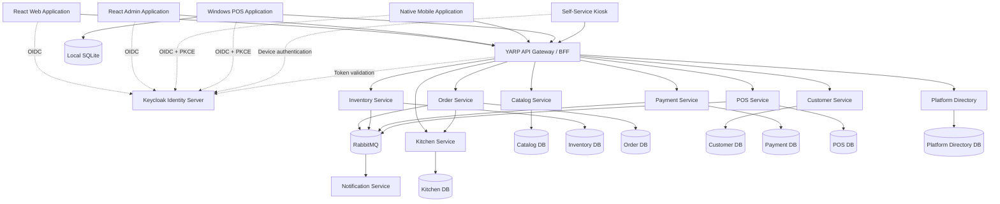

# NexaConnect Project Architecture

## 1. Purpose

NexaConnect is a restaurant operating platform that supports staff POS terminals, touch-screen self-service kiosks, kitchen ordering and display, customer QR ordering, reporting, and external integrations. Restaurant branches must continue approved operations during internet or cloud outages and synchronize safely after recovery. The architecture separates business capabilities into independently maintainable services while keeping the initial implementation practical for a small team.

Current implementation status: the repository provides solution scaffolding, JWT validation, local identity/infrastructure configuration, schema-first PostgreSQL tooling, PostgreSQL-backed Platform Directory and POS slices, PostgreSQL adapters for Catalog, Inventory, Customer, Payment, and Notification, migration-managed service projections, a durable PostgreSQL/RabbitMQ outbox and PostgreSQL aggregate/idempotency repository for Order, Keycloak client-credentials outbound authentication with retries, payment-failure compensation hooks, provider retry boundaries, a public place-order workflow endpoint, executable bounded-context API slices, and cross-service HTTP coverage for the Catalog -> Order -> Inventory -> Kitchen -> Payment workflow. Production provider credentials, offline synchronization, and broader product resource authorization remain planned.

The detailed restaurant domains, branch-edge topology, offline failure model, kitchen flow, QR behavior, reporting architecture, and shared identity boundary are defined in [Restaurant POS Architecture](Restaurant-POS-Architecture.md). This document defines the supporting technical architecture.

## 2. Architectural principles

1. **Business capability boundaries** — services are organized by domain responsibility rather than technical layer.
2. **Independent data ownership** — each service owns its schema or database and other services do not update its tables directly.
3. **API-first integration** — synchronous communication uses versioned HTTP APIs; asynchronous state changes use integration events.
4. **Centralized identity** — Keycloak provides OpenID Connect and OAuth 2.0 authentication.
5. **Defense in depth** — authentication occurs centrally, while resource-level authorization remains inside each business service.
6. **Observable by default** — logging, traces, metrics, and health checks are included from the beginning.
7. **Offline-aware POS** — the Windows POS client uses local storage and reliable synchronization.
8. **Incremental microservices** — avoid splitting services until a clear deployment, scaling, ownership, or reliability requirement exists.
9. **Branch resilience** — restaurant ordering, kitchen routing, cash payment, and receipt printing must not depend on continuous WAN connectivity.
10. **One order lifecycle** — POS, waiter, kiosk, and customer QR channels converge into the same Ordering capability.
11. **Reporting projections** — reporting consumes business events and never becomes a cross-service transactional query layer.
12. **Domain-driven design** — bounded contexts own their language, models, persistence, and integration contracts; tactical patterns are applied where business complexity justifies them.

## 3. High-level architecture



## 4. Solution structure

```text
NexaConnect/
├── docs/
│   ├── Architecture/
│   ├── API/
│   ├── Database/
│   └── Deployment/
├── docker/
│   ├── keycloak/
│   ├── postgres/
│   ├── redis/
│   ├── rabbitmq/
│   ├── prometheus/
│   └── grafana/
├── scripts/
├── src/
│   ├── Aspire/
│   │   ├── NexaConnect.AppHost/
│   │   └── NexaConnect.ServiceDefaults/
│   ├── BuildingBlocks/
│   │   ├── NexaConnect.BuildingBlocks/
│   │   ├── NexaConnect.Contracts/
│   │   ├── NexaConnect.Infrastructure/
│   │   └── NexaConnect.Shared/
│   ├── Gateway/
│   │   └── NexaConnect.Gateway/
│   ├── Tools/
│   │   ├── NexaConnect.DataMigration/
│   │   └── NexaConnect.DataGeneration/
│   ├── Services/
│   │   ├── NexaConnect.Services.Catalog/
│   │   ├── NexaConnect.Services.PlatformDirectory/
│   │   ├── NexaConnect.Services.Inventory/
│   │   ├── NexaConnect.Services.Order/
│   │   ├── NexaConnect.Services.Customer/
│   │   ├── NexaConnect.Services.Payment/
│   │   ├── NexaConnect.Services.Notification/
│   │   └── NexaConnect.Services.POS/
│   └── Clients/
│       ├── NexaConnect.Web/
│       ├── NexaConnect.Admin/
│       ├── NexaConnect.Mobile/
│       └── NexaConnect.POS/
└── tests/
    ├── Unit/
    ├── Integration/
    └── Architecture/
```

## 5. Component responsibilities

### 5.1 API Gateway

`NexaConnect.Gateway` is the public entry point for application clients. It uses YARP for routing and can implement client-specific Backend-for-Frontend endpoints.

Responsibilities:

- Validate access tokens.
- Route requests to internal services.
- Apply rate limits and request-size limits.
- Add correlation identifiers.
- Aggregate selected responses when justified.
- Hide internal service addresses.

The gateway must not contain core business rules.

### 5.2 Keycloak

Keycloak is deployed as a separate, shared identity platform rather than as an ASP.NET Core project. NexaConnect and other products integrate through OpenID Connect and OAuth 2.0 using separate clients and resource scopes; they do not share application authorization tables.

Shared organization and membership data is owned by a Platform Directory capability and distributed through versioned APIs and events. Products never query shared physical platform tables. This boundary is defined by [ADR-002](Decisions/ADR-002-shared-platform-data-ownership.md).

Recommended clients:

- `nexaconnect-web-bff` — confidential client.
- `nexaconnect-admin-bff` — confidential client.
- `platform-admin-bff` — separately deployed shared-platform dashboard client, owned outside NexaConnect.
- `nexaconnect-mobile` — public client using Authorization Code with PKCE.
- `nexaconnect-pos` — public client using Authorization Code with PKCE.
- One confidential service account per machine-to-machine workload.

Suggested realm roles:

- `system-admin`
- `tenant-admin`
- `store-manager`
- `cashier`
- `inventory-controller`
- `accountant`
- `report-viewer`
- `support-agent`

### 5.3 Catalog Service

Owns products, categories, barcodes, tax classifications, price definitions, and product availability metadata.

### 5.3.1 Platform Directory Service

Owns shared organizations, identity-subject memberships, and organization-level NexaConnect access. Its versioned organization-access API evaluates active membership and application enrollment; restaurant resource authorization remains product-owned.

### 5.4 Inventory Service

Owns warehouses, stock balances, stock movements, reservations, adjustments, and replenishment operations.

### 5.5 Order Service

Owns shopping carts, sales orders, order lines, returns, order status transitions, and order-level business rules.

The first business workflow is implemented in `Application/Workflow/PlaceOrderWorkflow.cs`. It snapshots Catalog prices, submits the Order aggregate, requests an Inventory reservation, creates a Kitchen ticket, authorizes Payment, and publishes versioned integration events after each accepted step. The workflow depends on Application-owned ports and does not share domain entities or persistence models across contexts.

### 5.6 Customer Service

Owns customer profiles, addresses, contact preferences, loyalty identifiers, and customer-specific business information.

### 5.7 Payment Service

Owns payment intents, provider transactions, payment status, refunds, and reconciliation references. It must not store sensitive card data unless the deployment is designed and certified for that purpose.

### 5.8 Kitchen Service

Owns preparation tickets, station-specific preparation snapshots, ticket status transitions, and payment-failure cancellation. It receives order-line snapshots through its authenticated HTTP API and never recalculates commercial totals or reads the Order database directly.

### 5.9 POS Service

Owns terminals, stores, shifts, cash sessions, device registration, synchronization state, and server-side processing of offline POS operations.

### 5.9 Notification Service

Consumes integration events and sends email, SMS, push, or in-application notifications. Notification failures must not roll back completed sales transactions.

### 5.10 Data Migration Tool

`NexaConnect.DataMigration` applies ordered, transactional PostgreSQL scripts for one service-owned database at a time. It checksum-validates and retains SQL content before execution, records schema history atomically with the migration, and bounds database commands and advisory-lock acquisition to 60 seconds. Non-transactional migrations are rejected.

### 5.11 Data Generation Tool

`NexaConnect.DataGeneration` imports deterministic CSV sample-data packages into one service-owned database at a time only when an explicitly named Development or test environment is configured. Repository SQL sample inserts are not supported; CSV imports require the owning service's restricted runtime credentials and cannot target reserved operational tables.

## 6. Internal service layout

Each new or materially changed business service follows Domain-Driven Design within a Clean Architecture-inspired layout, as accepted by [ADR-005](Decisions/ADR-005-domain-driven-design.md). A service normally represents one bounded context; when a deployable contains more than one module, each module keeps an explicit model and ownership boundary. Tactical DDD is applied according to business complexity rather than used to wrap simple CRUD in unnecessary abstractions. The restaurant bounded-context map is maintained in [Restaurant POS Architecture](Restaurant-POS-Architecture.md#4-business-capability-boundaries-and-bounded-contexts).

```text
NexaConnect.Services.Order/
├── Api/
├── Application/
├── Domain/
├── Infrastructure/
├── Contracts/
└── Tests/
```

For the first implementation, these can be folders inside one project. Split them into separate `.csproj` files only when compile-time boundaries provide clear value.

The required dependency direction is API to Application to Domain. Infrastructure implements interfaces owned by Application or Domain and is composed at the application boundary. Domain must not depend on ASP.NET Core, PostgreSQL providers, HTTP clients, message brokers, or other frameworks.

Bounded contexts do not share domain entities, persistence models, or internal DTOs. Aggregates enforce invariants and define transactional consistency boundaries. Repository interfaces express aggregate needs and do not expose generic table-level CRUD. Domain events remain internal; cross-context communication uses separately versioned integration events and an anti-corruption layer where external concepts differ from the local model.

### Domain

- Entities and value objects
- Domain rules
- Domain events
- Domain-specific exceptions

### Application

- Commands and queries
- Use cases
- Validation
- Interfaces for external dependencies
- Transaction boundaries

### Infrastructure

- Entity Framework Core
- Service-owned persistence implementations and parameterized raw SQL when justified
- Database migrations
- Message broker integration
- External provider clients
- File or object storage

### API

- HTTP endpoints
- Authentication and authorization policies
- Request/response mapping
- OpenAPI configuration
- Health checks

API endpoints must remain thin and must not issue SQL or contain business workflow rules. Application use cases coordinate work through narrow interfaces. Database operations belong in Infrastructure. Raw SQL must parameterize every runtime data value and must never concatenate untrusted input; dynamic identifiers are limited to validated, allow-listed metadata and use provider quoting. PostgreSQL integration tests cover security-sensitive filtering and transaction behavior. Authorization, tenant boundaries, financial limits, and other business decisions remain explicit in Domain or Application behavior, with database constraints and queries used as defense in depth.

This is a mandatory direction for new and materially changed code, not a claim that every existing service already conforms. The Restaurant authorization-scope controller and the Platform Directory and Authorization persistence paths now use Application-owned interfaces with Infrastructure-owned PostgreSQL implementations. The POS shift controller has likewise been moved to an Application and Infrastructure flow. The newly added cash-session and terminal-enrollment endpoints still have controller-level orchestration and remain the next POS layering refactor; legacy patterns must not be used as templates for new work.

## 7. Data architecture

PostgreSQL is the standard transactional database technology. Each service owns its data. Initial deployments may use one PostgreSQL cluster with separate databases and roles, but ownership boundaries must remain explicit.

Initial databases:

```text
PlatformDirectory
NexaConnect_Restaurant
NexaConnect_Catalog
NexaConnect_Inventory
NexaConnect_Order
NexaConnect_Kitchen
NexaConnect_Customer
NexaConnect_Payment
NexaConnect_POS
NexaConnect_Media
NexaConnect_Reporting
```

Version-1 schema migrations exist for all eleven databases. The migration catalog currently defines 83 tables and 99 explicit indexes, and the runner supports their versioned directories. The scripts remain pre-production until clean-install, downgrade, and re-upgrade tests pass against PostgreSQL 17.

Database creation is a provisioning concern, not a service migration. Local Docker initialization creates the eleven databases, one migration owner, and separate restricted runtime roles before service migrations are applied. Production uses the equivalent infrastructure-as-code and secret-management workflow.

Rules:

- A service never writes directly to another service database.
- Cross-service queries use APIs, read models, or replicated event-driven projections.
- Distributed database transactions are avoided.
- Schema migrations are owned and deployed by the corresponding service.
- Schema-first PostgreSQL scripts are the source of truth. Every released version provides paired, tested upgrade and downgrade scripts as defined by [ADR-001](Decisions/ADR-001-schema-first-versioned-migrations.md).
- Application releases declare required per-service schema versions and prefer expand-and-contract compatibility for rollback.
- Cross-product organization data is referenced by stable identifiers and consumed through the owning Platform Directory API, events, or local projections; it is not joined through shared tables.
- Database credentials are issued only to the owning runtime and migration process; clients and other services must use the owning API or integration events.
- Runtime database operations pass through the owning service's Infrastructure persistence implementations. API, Application, and Domain code do not issue database commands directly.
- Raw SQL is limited to Infrastructure and schema migration tooling, parameterizes every runtime data value, never concatenates untrusted input, and runs with least-privilege credentials and explicit transaction boundaries. Dynamic identifiers come only from validated, allow-listed metadata and use provider quoting.
- Local Compose infrastructure ports bind to loopback only; production infrastructure is not directly exposed to public networks.

## 8. Communication patterns

### Synchronous communication

Use HTTP/JSON initially. Use gRPC only for measured internal performance needs or strongly typed streaming scenarios.

Use synchronous calls when the caller needs an immediate response, such as retrieving product details or validating current availability.

### Asynchronous communication

Use RabbitMQ integration events for state changes that can be processed independently.

Example events:

- `ProductPriceChanged`
- `InventoryAdjusted`
- `OrderSubmitted`
- `InventoryReserved`
- `PaymentCompleted`
- `SaleCompleted`
- `ReceiptRequested`

Events are versioned contracts stored in `NexaConnect.Contracts`.

### Reliability

Services that update a database and publish an event must use the transactional outbox pattern. Event consumers must be idempotent and retain processed-message identifiers where necessary.

## 9. POS offline design

The recommended restaurant topology uses an always-on branch edge service so POS terminals, self-service kiosks, and kitchen displays can coordinate over the local network during WAN or cloud outages. The branch-edge decision must be confirmed before implementation. Windows POS and kiosk clients should also use local SQLite outboxes for brief device-to-edge outages.

The complete failure matrix, synchronization contract, kitchen behavior, QR limitations, and edge responsibilities are defined in [Restaurant POS Architecture](Restaurant-POS-Architecture.md).

Local data includes:

- Cached products and prices
- Store and terminal configuration
- Current shift information
- Pending sales
- Pending payment confirmations where permitted
- Synchronization outbox
- Synchronization checkpoints

Offline operations use client-generated globally unique identifiers. The server must support idempotency so resending the same operation does not create duplicate sales or payments.

Sensitive manager operations, high-value refunds, and terminal revocation checks should require an online connection according to configurable policy.

## 10. Frontend architecture

### Web and Admin

Recommended stack:

- React
- TypeScript
- Vite
- Ant Design
- React Router
- TanStack Query
- React Hook Form or Ant Design Form
- Zod

Organize by business feature:

```text
src/
├── app/
├── features/
│   ├── catalog/
│   ├── inventory/
│   ├── orders/
│   ├── customers/
│   └── reporting/
├── shared/
├── api/
└── layouts/
```

The browser should preferably authenticate through an ASP.NET Core BFF using secure HTTP-only cookies. Avoid storing long-lived refresh tokens in browser local storage.

Administration follows [ADR-003](Decisions/ADR-003-platform-and-product-dashboard-separation.md). The shared platform owns a separately deployed Platform Admin Dashboard for cross-product control-plane functions. NexaConnect owns `NexaConnect.Admin` for restaurant-specific administration. Each uses a separate OIDC client, BFF, cookie, scope, audience, API, and deployment boundary. Neither dashboard accesses PostgreSQL directly.

### Mobile

Use .NET MAUI or React Native. Native clients use Authorization Code with PKCE and secure operating-system credential storage.

### Windows POS

Use WPF or WinUI 3 when deep Windows hardware integration is required. Hardware adapters should be isolated behind interfaces for receipt printers, barcode scanners, cash drawers, customer displays, and payment terminals.

The current WPF scaffold uses the system browser for Keycloak Authorization Code + PKCE S256, validates state on the `nexaconnect-pos://oauth/callback` custom-scheme callback, accepts each callback once, forwards bounded callbacks to the primary instance through a current-user-only named pipe, and protects the token set with Windows Data Protection. It includes shift open/close UI, cash-session and terminal-enrollment API contracts, sign-out/token clearing, hardware-adapter interfaces, durable local outbox primitives, and a local active-shift recovery reference. Production hardware drivers and operation-specific replay wiring remain deployment work. The installer must register the custom URI protocol.

### Self-service kiosk

The kiosk is a touch-first ordering client, not a separate business service. It uses the shared Menu, Ordering, Kitchen, Payment, POS Operations, and Reporting capabilities. It requires locked-down device mode, customer-session clearing, device authentication, local caching and outbox behavior, accessibility, and isolated hardware adapters. Windows-native and browser/PWA delivery remain options until the hardware profile is confirmed.

## 11. Shared projects

Shared code must be kept deliberately small.

### `NexaConnect.Contracts`

Contains integration event contracts and stable cross-service message definitions.

### `NexaConnect.Shared`

Contains low-level primitives that have no business ownership, such as result types, correlation helpers, and common serialization conventions.

### `NexaConnect.Infrastructure`

Contains reusable infrastructure registration helpers. It must not become a dependency that couples all services to one database or messaging implementation.

### `NexaConnect.BuildingBlocks`

Contains carefully selected architectural building blocks such as outbox abstractions, idempotency interfaces, and domain event dispatching.

Do not place service-specific entities or business rules in shared projects.

## 12. Observability

Every backend component should provide:

- Structured logs
- Distributed traces
- Metrics
- Liveness and readiness health checks
- Correlation IDs

Use OpenTelemetry for instrumentation. Local development can use Aspire dashboards. Production exporters can target an OpenTelemetry Collector, Prometheus, Grafana, or the selected cloud platform.

Never log passwords, access tokens, refresh tokens, payment secrets, or sensitive personal data.

## 13. Security

- TLS is required outside local development.
- Access tokens should be short-lived.
- Authorization policies must validate tenant and store boundaries.
- Public clients must not contain client secrets.
- Secrets must come from environment variables, development user secrets, or a managed secret store.
- Administrative endpoints require separate roles and stronger controls.
- Audit records should be immutable from normal application workflows.
- API input is validated at the boundary.
- Rate limiting is applied to authentication-sensitive and public endpoints.

## 14. Testing strategy

### Unit tests

Test domain rules, calculations, validation, and application use cases without external infrastructure.

### Integration tests

Test database mappings, migrations, message publication, event consumption, authentication policies, and API behavior using disposable infrastructure where practical.

### Architecture tests

Enforce boundaries such as:

- Domain must not depend on Infrastructure.
- Services must not reference another service's implementation assembly.
- API layers must not contain domain persistence logic.
- Bounded contexts must not share domain entities or persistence models.
- Domain events must remain separate from versioned integration events.

### End-to-end tests

Use Playwright for web flows and targeted end-to-end tests for critical checkout, payment, and POS synchronization scenarios.

## 15. Deployment

Initial production deployment can use Docker containers on a managed container platform or virtual machines. Kubernetes should be introduced only when its operational benefits justify its complexity.

Core deployable units:

- Keycloak
- API Gateway
- Business services
- PostgreSQL
- MinIO or an S3-compatible object store
- Redis
- RabbitMQ
- Observability components

Each service should be independently buildable, configurable, deployable, and rollback-capable.

## 16. Recommended implementation order

1. Confirm the branch-edge hardware and offline failure model.
2. Define the shared identity, tenant, restaurant, branch, employee, and role contract.
3. Model the dine-in order, modifier, kitchen ticket, shift, cash payment, and synchronization lifecycles.
4. Define idempotency, acknowledgements, checkpoints, conflicts, and offline recovery behavior.
5. Create solution standards, PostgreSQL conventions, shared service defaults, and observability.
6. Configure the shared identity clients and application authorization boundaries.
7. Build one design-validated vertical slice from POS order entry through kitchen completion and cash payment.
8. Test the slice through WAN loss, restart, retry, duplication, and recovery scenarios.
9. Add QR ordering after its online and offline availability requirements are decided.
10. Add kiosk ordering after its device, payment, peripheral, and offline requirements are decided.
11. Add reporting projections and validate replay, reconciliation, and data freshness.
12. Expand Menu, Inventory, Payment, Customer, Media, and Notification capabilities incrementally.

## 17. Architecture decisions to document later

Create Architecture Decision Records for major choices, including:

- Keycloak as identity provider
- PostgreSQL database-per-service deployment and recovery strategy
- RabbitMQ versus another message broker
- WPF versus WinUI for POS
- React BFF authentication approach
- Database-per-service deployment strategy
- Multi-tenancy model
- Payment provider and PCI scope
- Branch-edge deployment and support model
- QR ordering behavior during WAN outages
- Offline payment policy by payment method and provider
- Shared identity claims and cross-product authorization boundaries
- Kitchen Display System deployment model
- Synchronization conflict policy by entity and operation
- Reporting consistency, retention, and replay strategy
- Kiosk application platform, device enrollment, and locked-down deployment
- Kiosk payment, printer, scanner, cash hardware, accessibility, and outage behavior
- Platform dashboard hosting, navigation, support elevation, and summary contracts
- Restaurant-owner versus internal product-operator dashboard views
