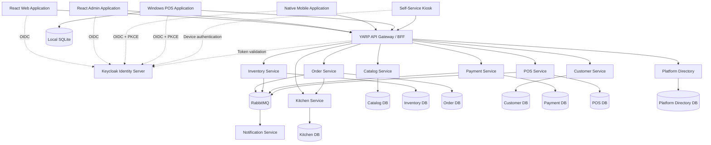

# NexaConnect Project Architecture

Portal roadmap status: Phases 1-4, 6, and 7 are complete for their documented development scope; Phase 5 BFF hardening and the Phase 8 Customer Portal and Phase 9 Media functional slices are implemented. An opt-in Playwright harness joins the authenticated Customer Portal and Media lifecycle, but environment-specific execution, recovery, load, security validation, and production operational hardening remain release gates. Phase 10 product integration is partial, Phase 11 testing is continuous, and Phase 12 has a development foundation with production hardening planned.

Inventory transactionally records tenant-scoped stock-set, reservation-created, and reservation-released contracts with append-only audit state. Migration 1 owns its outbox; migration 5 owns durable simplified-table reservation identity and product audit. A transaction-scoped organization/order lock serializes concurrent retries, and release publishes/restores only once. Trusted unscoped PostgreSQL paths remain legacy/non-publishing. All seven opt-in acceptances passed locally against PostgreSQL 17 and RabbitMQ, including confirmed persistent publication of all three events and the actual migration runner's 0→5→4→5 lifecycle. The broker case uses a new recovery connection rather than proving established-dispatcher reconnection. The Inventory Phase 10 slice is closed.

Payment intent creation requires organization context for customer and trusted Order calls; only the exact Order workload bypasses customer authorization. Authorization, capture recovery, and pre-capture void recovery distinguish definitive outcomes from uncertainty. Provider calls and status lookups occur outside database transactions; local transitions append audit and outbox events atomically. Payment migrations 6-7 own capture/void recovery and Reporting migrations 11-12 own their audit vocabularies. Order migrations 2-3 durably consume reconciliation, persist organization/payment-intent ownership, complete only confirmed capture, compensate definitive failure or confirmed void, and retain work during uncertainty. Downstream compensation remains retry-at-least-once and depends on Inventory/Kitchen idempotency by order identity. Local recovery and rollback-forward evidence passed. Concrete-provider, live RabbitMQ void replay, production paging/escalation, and live-traffic rollback validation remain environment-specific gates. Refunds and settlement remain planned.

Kitchen ticket lifecycle enforces legal ticket transitions, exact Order workload creation/compensation, dedicated Kitchen workload authorization-scope lookup, migration-backed operator permissions, tenant-authorized operator reads/transitions, conflict-safe station snapshots, organization-leading PostgreSQL, append-only history/audit, and transactional lifecycle/audit events. Reporting migration 5 accepts Kitchen vocabulary. Five coordinated live acceptances cover multi-station identity, rollback, RabbitMQ recovery, Reporting replay, and Kitchen 0→3→2→3. Item-level/KDS/offline workflows remain planned.

Customer profile creation now uses Domain validation, tenant-only authorization, organization-leading conflict-safe replay, append-only audit that excludes profile fields, and transactional `customer.profile-created.v1`/`customer.audit.v1` publication through the migration-1 outbox. Customer migration 2 owns audit objects and Reporting migration 6 owns compatible projection/replay vocabulary. Six coordinated PostgreSQL 17/RabbitMQ acceptances passed locally, including concurrent replay, atomic rollback, confirmed publication, Reporting replay, and the actual 0→2→1→2 runner. The creation slice is closed; profile status transitions and detailed customer data workflows remain planned.

POS cash-movement replay now has successful live PostgreSQL evidence. Seven isolated-schema cases passed locally against PostgreSQL 17, covering exact and concurrent replay, atomic rollback, terminal/shift-subject denial, active terminal scope, shift persistence/concurrency, and duplicate-open conflict. The run exposed and corrected an Npgsql multi-command completion issue before acceptance. The actual migration runner then passed 0→3→2→3 in a safely named disposable database, validating immutable checksums/history, migration-3 close-authorization ownership, retained migration-1 replay/cash data on downgrade, and real repository writes before and after re-upgrade. Production SQLite client persistence and order/shift/device synchronization remain open.

Phase 10 Catalog status: PostgreSQL menu-item upserts transactionally persist append-only product audit plus versioned menu-change and audit outbox messages. RabbitMQ dispatch is opt-in; committed rows remain durable when dispatch is disabled or a broker connection is unavailable. The shared transport now establishes its connection lazily and replaces a closed or failed owned connection while the dispatcher retains unpublished rows for retry. Migration 1 owns the outbox; migration 4 owns the audit objects and its destructive downgrade preserves outbox state.

Phase 11 includes opt-in Catalog component tests for that transaction boundary, forced rollback, append-only trigger, retry state, and migration 4 downgrade/re-upgrade against isolated live PostgreSQL schemas. Real RabbitMQ acceptance verifies an unreachable connection attempt, a Catalog commit without a broker connection, and later publication over a newly established real connection using production publisher confirms, persistent messages, isolated queue consumption, and publication timestamps. It does not stop a broker or exercise automatic reconnection of an established dispatcher connection. This closes the Catalog Phase 10 integration slice; a successful production-like run of the full migration acceptance remains a release gate.

The full-database Catalog migration acceptance now invokes the actual runner for 0→4→3→4 in a uniquely named disposable database and validates immutable history, schema transitions, and repository writes. Version 1 remains the outbox owner; version 4 adds/removes only Catalog audit objects. The test is implemented but has not run successfully in the current local environment because the configured PostgreSQL administrator password is stale and the restricted migration identity intentionally lacks `CREATEDB`; no role or password was changed.

Phase 4 tenant-API status: Platform Directory resolves authenticated membership and enabled product access; Catalog, Inventory, Order, Kitchen, Payment, and Customer enforce product-owned permissions and resource ownership. Customer persistence paths are organization-scoped, and conflicting browser tenant identifiers fail closed. Portals remain database-free.

## 1. Purpose

NexaConnect is a restaurant operating platform that supports staff POS terminals, touch-screen self-service kiosks, kitchen ordering and display, customer QR ordering, reporting, and external integrations. Restaurant branches must continue approved operations during internet or cloud outages and synchronize safely after recovery. The architecture separates business capabilities into independently maintainable services while keeping the initial implementation practical for a small team.

Current implementation status: the repository provides solution scaffolding, JWT validation, local identity/infrastructure configuration, schema-first PostgreSQL tooling, Platform Directory organization-access and current-tenant access contracts, separate Customer and Platform Admin BFF session boundaries with required production Redis ticket storage, distinct platform/customer/product role sets, independently approved and time-limited support elevation with append-only audit history, PostgreSQL-backed Platform Directory and POS slices, POS cash-movement replay dedupe through terminal-scoped `sync_operations`, PostgreSQL adapters for Catalog, Inventory, Kitchen, Customer, Payment, and Notification, migration-managed service projections, durable PostgreSQL/RabbitMQ outbox and inbox primitives, PostgreSQL aggregate/idempotency persistence for Order, Keycloak client-credentials outbound authentication with retries, payment-failure compensation hooks, durable Notification provider submission/receipt reconciliation, provider retry boundaries, a public place-order workflow endpoint, executable bounded-context API slices, and cross-service HTTP coverage for the Catalog -> Order -> Inventory -> Kitchen -> Payment workflow. Catalog, Order, Inventory, Kitchen, Customer, Payment, and Notification enforce their implemented customer-facing authorization and ownership boundaries. Concrete production provider acceptance, offline synchronization beyond the implemented POS cash-movement replay path, and authorization for remaining product resources remain planned.

The centralized observability foundation supplies structured JSON console logs, validated correlation identifiers, and optional OTLP signals. Platform Directory, both BFF foundations, and the Catalog, Inventory, Order, Kitchen, Payment, Customer, POS, Authorization, and Restaurant services adopt it. Locally, logs are retained in Loki, service metrics are retained and rules evaluated in Prometheus, resulting alerts are routed by Alertmanager, RabbitMQ queue metrics are scraped directly, Grafana provisions both sources, and traces reach the Collector debug exporter. Payment exposes distinct liveness and PostgreSQL/migration readiness without coupling readiness to provider availability, plus capture/outbox backlog-age gauges; Order exposes reconciliation-inbox/outbox backlog-age gauges. Local Alertmanager has no external receiver; production ingestion security, durable storage, retention, access hardening, alert delivery, and a trace backend remain required. See [ADR-007](Decisions/ADR-007-centralized-observability-foundation.md).

The detailed restaurant domains, branch-edge topology, offline failure model, kitchen flow, QR behavior, reporting architecture, and shared identity boundary are defined in [Restaurant POS Architecture](Restaurant-POS-Architecture.md). This document defines the supporting technical architecture.

## 2. Architectural principles

1. **Business capability boundaries** — services are organized by domain responsibility rather than technical layer.
2. **Independent data ownership** — each service owns its schema or database and other services do not update its tables directly.
3. **API-first integration** — synchronous communication uses versioned HTTP APIs; asynchronous state changes use integration events.
4. **Centralized identity** — Keycloak provides OpenID Connect and OAuth 2.0 authentication.
5. **Defense in depth** — authentication occurs centrally, while resource-level authorization remains inside each business service.
6. **Observable by default** — logging, traces, metrics, and health checks are included from the beginning.
7. **Offline-aware POS** — the Windows POS client uses local storage and reliable synchronization.
8. **Incremental microservices** — avoid splitting services until a clear deployment, scaling, ownership, or reliability requirement exists.
9. **Branch resilience** — restaurant ordering, kitchen routing, cash payment, and receipt printing must not depend on continuous WAN connectivity.
10. **One order lifecycle** — POS, waiter, kiosk, and customer QR channels converge into the same Ordering capability.
11. **Reporting projections** — reporting consumes business events and never becomes a cross-service transactional query layer.
12. **Domain-driven design** — bounded contexts own their language, models, persistence, and integration contracts; tactical patterns are applied where business complexity justifies them.

## 3. High-level architecture



## 4. Solution structure

```text
NexaConnect/
├── docs/
│   ├── Architecture/
│   ├── API/
│   ├── Database/
│   └── Deployment/
├── docker/
│   ├── keycloak/
│   ├── postgres/
│   ├── redis/
│   ├── rabbitmq/
│   ├── prometheus/
│   └── grafana/
├── scripts/
├── src/
│   ├── Aspire/
│   │   ├── NexaConnect.AppHost/
│   │   └── NexaConnect.ServiceDefaults/
│   ├── BuildingBlocks/
│   │   ├── NexaConnect.BuildingBlocks/
│   │   ├── NexaConnect.Contracts/
│   │   ├── NexaConnect.Infrastructure/
│   │   └── NexaConnect.Shared/
│   ├── Gateway/
│   │   └── NexaConnect.Gateway/
│   ├── Tools/
│   │   ├── NexaConnect.DataMigration/
│   │   └── NexaConnect.DataGeneration/
│   ├── Services/
│   │   ├── NexaConnect.Services.Catalog/
│   │   ├── NexaConnect.Services.PlatformDirectory/
│   │   ├── NexaConnect.Services.Inventory/
│   │   ├── NexaConnect.Services.Order/
│   │   ├── NexaConnect.Services.Customer/
│   │   ├── NexaConnect.Services.Payment/
│   │   ├── NexaConnect.Services.Notification/
│   │   └── NexaConnect.Services.POS/
│   └── Clients/
│       ├── NexaConnect.Web/
│       ├── NexaConnect.Admin/
│       ├── NexaConnect.Mobile/
│       └── NexaConnect.POS/
└── tests/
    ├── Unit/
    ├── Integration/
    └── Architecture/
```

## 5. Component responsibilities

### 5.1 API Gateway

`NexaConnect.Gateway` is the public entry point for application clients. It uses YARP for routing and can implement client-specific Backend-for-Frontend endpoints.

Responsibilities:

- Validate access tokens.
- Route requests to internal services.
- Apply rate limits and request-size limits.
- Add correlation identifiers.
- Aggregate selected responses when justified.
- Hide internal service addresses.

The gateway must not contain core business rules.

### 5.2 Keycloak

Keycloak is deployed as a separate, shared identity platform rather than as an ASP.NET Core project. NexaConnect and other products integrate through OpenID Connect and OAuth 2.0 using separate clients and resource scopes; they do not share application authorization tables.

Shared organization and membership data is owned by a Platform Directory capability and distributed through versioned APIs and events. Products never query shared physical platform tables. This boundary is defined by [ADR-002](Decisions/ADR-002-shared-platform-data-ownership.md).

Recommended clients:

- `nexaconnect-web-bff` — confidential client.
- `nexaconnect-admin-bff` — confidential client.
- `platform-admin-bff` — separately deployed shared-platform dashboard client, owned outside NexaConnect.
- `nexaconnect-mobile` — public client using Authorization Code with PKCE.
- `nexaconnect-pos` — public client using Authorization Code with PKCE.
- One confidential service account per machine-to-machine workload.

Implemented platform roles:

- `platform-owner`
- `platform-admin`
- `platform-support`
- `platform-auditor`

Implemented customer roles:

- `customer-owner`
- `customer-admin`
- `customer-manager`
- `customer-user`
- `customer-viewer`

Product-specific realm roles remain separate:

- `tenant-admin`
- `store-manager`
- `cashier`
- `inventory-controller`
- `accountant`
- `report-viewer`

`system-admin` and `support-agent` are legacy compatibility roles; new portal authorization uses the explicit platform role set.

### 5.3 Catalog Service

Owns products, categories, barcodes, tax classifications, price definitions, and product availability metadata.

The implemented menu-item write path keeps transport concerns in `MenuController`, mutation context in the Application contract, and PostgreSQL commands in `PostgresMenuCatalog`. In PostgreSQL mode, one database transaction upserts the organization/branch/product menu snapshot, appends an immutable product audit record, and enqueues `catalog.menu-item.changed.v1` plus `catalog.audit.v1`. Outbox rows remain durable when dispatch is disabled; `Outbox:Enabled=true` starts the shared RabbitMQ dispatcher. The in-memory adapter intentionally provides neither audit durability nor publication.

### 5.3.1 Platform Directory Service

Owns shared organizations, identity-subject memberships, and organization-level NexaConnect access. Its versioned organization-access API evaluates active membership and application enrollment; restaurant resource authorization remains product-owned.

### 5.4 Inventory Service

Owns warehouses, stock balances, stock movements, reservations, adjustments, and replenishment operations.

### 5.5 Order Service

Owns shopping carts, sales orders, order lines, returns, order status transitions, and order-level business rules.

The first business workflow is implemented in `Application/Workflow/PlaceOrderWorkflow.cs`. It snapshots Catalog prices, submits the Order aggregate, requests an Inventory reservation, creates a Kitchen ticket, authorizes Payment, and publishes versioned integration events after each accepted step. The workflow depends on Application-owned ports and does not share domain entities or persistence models across contexts.

### 5.6 Customer Service

Owns customer profiles, addresses, contact preferences, loyalty identifiers, and customer-specific business information.

The implemented creation slice keeps normalization and initial-state invariants in Domain, authorization/orchestration in Application, and PostgreSQL/audit/outbox behavior in Infrastructure. Only tenant-authorized customer subjects may create/read; broad service workloads do not bypass this boundary. Matching organization/customer-number retries return the existing profile without republishing, while conflicting profile or profile-identity-subject reuse fails explicitly. Integration and audit payloads exclude names, profile identity subjects, contacts, addresses, preferences, and attributes; audit retains a restricted actor subject for accountability.

### 5.7 Payment Service

Owns payment intents, provider transactions, payment status, refunds, and reconciliation references. It must not store sensitive card data unless the deployment is designed and certified for that purpose.

The Payment lifecycle uses a small Domain aggregate for validation and normalization, Application-owned repository/provider ports, and Infrastructure-owned PostgreSQL/outbox/provider adapters. Migration 2 adds organization attribution and append-only audit while migration 1 remains the outbox owner; migrations 3-4 add recoverable authorization, migration 5 adds immediate capture, migration 6 adds capture recovery, and migration 7 adds durable void recovery. Matching idempotent intent retries return the original without republishing. Capture and void are Order-only and keep provider I/O outside database transactions. Void accepts only authorized, uncaptured intents, uses `void:{intent-id}` for provider idempotency, distinguishes failure from uncertainty, and treats captured payments as refund-only. Recovery performs provider status lookup instead of repeating an uncertain void; local state, audit, and versioned lifecycle events commit atomically. Reporting migration 12 accepts the void vocabulary. Order migration 3 durably consumes void outcomes and owns `payment_review`; refunds and settlement are not enabled.

Capture recovery is implemented through provider status lookup, recoverable capture leases, a bounded recovery worker, conservative resolution of `capturing`/`capture_unknown`, transactional `PaymentCaptureReconciledV1` publication, durable Order reconciliation, Payment migration 6, Order migration 2, and Reporting migration 11. Void recovery and Order consumption extend the same conservative pattern through Payment 7, Order 3, and Reporting 12. `PaymentProvider:CaptureRecoveryEnabled` and `PaymentProvider:VoidRecoveryEnabled` pause their respective workers without mutating durable state. The shared RabbitMQ transport owns a lazy recoverable connection while durable rows remain retryable. Concrete-provider credentials/TLS/rate limits, production paging/escalation, live void replay, dedicated void alerts, refunds, and settlement remain release or subsequent-slice work.

Order migration 4 adds the payment-review resolution aggregate boundary: organization/branch-scoped reads, dedicated Authorization migration-5 provisioning/backfill, optimistic operator decisions, append-only history, and atomic `order.payment-review-resolved.v1` plus `order.audit.v1` publication. Tenant administrators and store managers receive read/resolve permissions when assigned before or after migration; branch-scoped accountants receive read only. `confirm_void` performs retry-at-least-once Inventory/Kitchen compensation before committing payment failure; `resume_payment` returns the same bound intent to pending reconciliation; `escalate` advances the case version while retaining review. Reporting migration 13 accepts the safe resolution audit vocabulary. Open-case count/age telemetry is implemented. The guarded operations matrix verifies Reporting downgrade/replay, repository-produced contracts through hosted-dispatcher failure/restart and confirmed broker publication, hosted Reporting projection/deduplication, and isolated alert routing. The Customer Portal now calls tenant-revalidated Customer BFF Application/Infrastructure review adapters for branch access, actionable cases, details, and the latest 100 immutable Order history entries. Protected-cookie subject/product/membership checks precede forwarding; Order independently checks branch permissions. Resolution requires anti-forgery proof plus an explicitly confirmed reason/version. Tenant changes abort and clear UI state; conflicts/ambiguous outcomes refresh without automatic retry. No provider call or new schema is introduced by the UI. Joined live operator/identity-provider acceptance, successful verification against each release target, production paging/acknowledgement and threshold calibration remain gates. See [operator contract](../API/Payment-Review-Operator-UI.md).

Retained local evidence is recorded in [Phase 11 capture recovery](Evidence/Phase-11-Payment-Capture-Recovery.md), [Payment Review sign-off](Evidence/Phase-11-Payment-Review-Live-Verification.md), and [Phase 12 operational rehearsal](Evidence/Phase-12-Payment-Operational-Rehearsal.md). Payment Review's eight-case local matrix passed on 2026-08-31, adding HTTP boundary/attribution coverage, competing-claim and expired-lease fencing, and a prefetch-one duplicate-acknowledgement barrier. Live identity-provider configuration and production operational gates remain separately owned.

### 5.8 Kitchen Service

Owns preparation tickets, station-specific preparation snapshots, ticket status transitions, and payment-failure cancellation. It receives order-line snapshots through its authenticated HTTP API and never recalculates commercial totals or reads the Order database directly.

The ticket-level slice restricts create/cancel to Order, authorizes operator read/transition through Platform Directory, Restaurant, and Authorization, and atomically persists status/history/audit/outbox state in PostgreSQL. Migration 3 fixes station-distinct ticket numbering and adds tenant ownership/fingerprints.

### 5.9 POS Service

Owns terminals, stores, shifts, cash sessions, device registration, synchronization state, and server-side processing of offline POS operations.

The implemented offline synchronization foothold is cash-movement replay idempotency. The native POS client persists stable operation and terminal identifiers before its first HTTP attempt and sends that same pair on every replay. POS Infrastructure verifies the terminal and authenticated subject against the shift, then stores the terminal-scoped operation in `sync_operations` and commits it with the cash movement. Exact and concurrent retries are accepted without duplicating cash totals, transaction failure rolls back both records, missing or malformed headers fail with `400`, scope mismatch fails with `403`, and mismatched payload reuse fails with `409`. The native client retains rejected operations without an unaudited discard action, continues later pending work, allows authenticated retry after operator correction, and blocks cash-session close until queued/in-flight/rejected movements are resolved. Legacy entries without a persisted terminal identity fail closed. Its current JSON queue remains a development scaffold; production SQLite and atomic local business-state/outbox persistence remain open.

### 5.9 Notification Service

Consumes integration events and sends email, SMS, push, or in-application notifications. Notification failures must not roll back completed sales transactions.

Its durable integration slice owns `NotificationRequestedV1` consumption, inbox/source-event deduplication, organization-scoped notification persistence, provider delivery/reconciliation, append-only attempts and audit, and transactional queue/lifecycle publication. PostgreSQL remains authoritative: a lease worker uses Notification ID for provider idempotency, reclaims expired work, applies Application-owned bounded retry policy, and polls receipts to delivered or terminal failure. Tenant API access is revalidated through Platform Directory and Authorization and does not expose internal source-event identity; Customer BFF derives the organization context. Recipient preferences remain Customer-owned and must be resolved by an approved producer/orchestrator rather than copied into shared domain entities. Provider webhooks are deferred until a signed callback contract exists.

### 5.10 Data Migration Tool

`NexaConnect.DataMigration` applies ordered, transactional PostgreSQL scripts for one service-owned database at a time. It checksum-validates and retains SQL content before execution, records schema history atomically with the migration, and bounds database commands and advisory-lock acquisition to 60 seconds. Non-transactional migrations are rejected.

### 5.11 Data Generation Tool

`NexaConnect.DataGeneration` imports deterministic CSV sample-data packages into one service-owned database at a time only when an explicitly named Development or test environment is configured. Repository SQL sample inserts are not supported; CSV imports require the owning service's restricted runtime credentials and cannot target reserved operational tables.

## 6. Internal service layout

Each new or materially changed business service follows Domain-Driven Design within a Clean Architecture-inspired layout, as accepted by [ADR-005](Decisions/ADR-005-domain-driven-design.md). A service normally represents one bounded context; when a deployable contains more than one module, each module keeps an explicit model and ownership boundary. Tactical DDD is applied according to business complexity rather than used to wrap simple CRUD in unnecessary abstractions. The restaurant bounded-context map is maintained in [Restaurant POS Architecture](Restaurant-POS-Architecture.md#4-business-capability-boundaries-and-bounded-contexts).

```text
NexaConnect.Services.Order/
├── Api/
├── Application/
├── Domain/
├── Infrastructure/
├── Contracts/
└── Tests/
```

For the first implementation, these can be folders inside one project. Split them into separate `.csproj` files only when compile-time boundaries provide clear value.

The required dependency direction is API to Application to Domain. Infrastructure implements interfaces owned by Application or Domain and is composed at the application boundary. Domain must not depend on ASP.NET Core, PostgreSQL providers, HTTP clients, message brokers, or other frameworks.

Bounded contexts do not share domain entities, persistence models, or internal DTOs. Aggregates enforce invariants and define transactional consistency boundaries. Repository interfaces express aggregate needs and do not expose generic table-level CRUD. Domain events remain internal; cross-context communication uses separately versioned integration events and an anti-corruption layer where external concepts differ from the local model.

### Domain

- Entities and value objects
- Domain rules
- Domain events
- Domain-specific exceptions

### Application

- Commands and queries
- Use cases
- Validation
- Interfaces for external dependencies
- Transaction boundaries

### Infrastructure

- Entity Framework Core
- Service-owned persistence implementations and parameterized raw SQL when justified
- Database migrations
- Message broker integration
- External provider clients
- File or object storage

### API

- HTTP endpoints
- Authentication and authorization policies
- Request/response mapping
- OpenAPI configuration
- Health checks

API endpoints must remain thin and must not issue SQL or contain business workflow rules. Application use cases coordinate work through narrow interfaces. Database operations belong in Infrastructure. Raw SQL must parameterize every runtime data value and must never concatenate untrusted input; dynamic identifiers are limited to validated, allow-listed metadata and use provider quoting. PostgreSQL integration tests cover security-sensitive filtering and transaction behavior. Authorization, tenant boundaries, financial limits, and other business decisions remain explicit in Domain or Application behavior, with database constraints and queries used as defense in depth.

This is a mandatory direction for new and materially changed code, not a claim that every existing service already conforms. The Restaurant authorization-scope controller and the Platform Directory and Authorization persistence paths now use Application-owned interfaces with Infrastructure-owned PostgreSQL implementations. POS shift, cash-session, and terminal-enrollment flows also use Application services and Application-owned persistence ports with Infrastructure PostgreSQL adapters; their controllers retain only authenticated transport context and HTTP response mapping. Legacy patterns must not be used as templates for new work.

## 7. Data architecture

PostgreSQL is the standard transactional database technology. Each service owns its data. Initial deployments may use one PostgreSQL cluster with separate databases and roles, but ownership boundaries must remain explicit.

Initial databases:

```text
PlatformDirectory
NexaConnect_Restaurant
NexaConnect_Catalog
NexaConnect_Inventory
NexaConnect_Order
NexaConnect_Kitchen
NexaConnect_Customer
NexaConnect_Payment
NexaConnect_POS
NexaConnect_Media
NexaConnect_Reporting
```

Versioned schema migrations exist for all 13 service databases. The migration catalog currently defines 112 tables and 128 explicit indexes; Platform Directory version 3 adds append-only platform-administration audit records to its organization, access, and support-elevation state, while Customer version 2 adds append-only audit that excludes profile fields and preserves its version-1 outbox. The scripts remain pre-production until every script passes clean-install, downgrade, and re-upgrade tests against PostgreSQL 17.

Database creation is a provisioning concern, not a service migration. Local Docker initialization creates the 13 catalog databases, one migration owner, and separate restricted runtime roles before service migrations are applied. Production uses the equivalent infrastructure-as-code and secret-management workflow.

Rules:

- A service never writes directly to another service database.
- Cross-service queries use APIs, read models, or replicated event-driven projections.
- Distributed database transactions are avoided.
- Schema migrations are owned and deployed by the corresponding service.
- Schema-first PostgreSQL scripts are the source of truth. Every released version provides paired, tested upgrade and downgrade scripts as defined by [ADR-001](Decisions/ADR-001-schema-first-versioned-migrations.md).
- Application releases declare required per-service schema versions and prefer expand-and-contract compatibility for rollback.
- Cross-product organization data is referenced by stable identifiers and consumed through the owning Platform Directory API, events, or local projections; it is not joined through shared tables.
- Database credentials are issued only to the owning runtime and migration process; clients and other services must use the owning API or integration events.
- Runtime database operations pass through the owning service's Infrastructure persistence implementations. API, Application, and Domain code do not issue database commands directly.
- Raw SQL is limited to Infrastructure and schema migration tooling, parameterizes every runtime data value, never concatenates untrusted input, and runs with least-privilege credentials and explicit transaction boundaries. Dynamic identifiers come only from validated, allow-listed metadata and use provider quoting.
- Local Compose infrastructure ports bind to loopback only; production infrastructure is not directly exposed to public networks.

## 8. Communication patterns

### Synchronous communication

Use HTTP/JSON initially. Use gRPC only for measured internal performance needs or strongly typed streaming scenarios.

Use synchronous calls when the caller needs an immediate response, such as retrieving product details or validating current availability.

### Asynchronous communication

Use RabbitMQ integration events for state changes that can be processed independently.

Example events:

- `ProductPriceChanged`
- `InventoryAdjusted`
- `OrderSubmitted`
- `InventoryReserved`
- `PaymentCompleted`
- `SaleCompleted`
- `ReceiptRequested`

Events are versioned contracts stored in `NexaConnect.Contracts`.

### Reliability

Services that update a database and publish an event must use the transactional outbox pattern. Event consumers must be idempotent and retain processed-message identifiers where necessary.

Durable consumers use the service-owned `inbox_messages` table with a processing lease, attempt count, completion marker, and retry error category. The inbox claim is separate from RabbitMQ delivery acknowledgement; handlers must mark completion only after their side effects succeed.

## 9. POS offline design

The recommended restaurant topology uses an always-on branch edge service so POS terminals, self-service kiosks, and kitchen displays can coordinate over the local network during WAN or cloud outages. The branch-edge decision must be confirmed before implementation. Windows POS and kiosk clients should also use local SQLite outboxes for brief device-to-edge outages.

The complete failure matrix, synchronization contract, kitchen behavior, QR limitations, and edge responsibilities are defined in [Restaurant POS Architecture](Restaurant-POS-Architecture.md).

Local data includes:

- Cached products and prices
- Store and terminal configuration
- Current shift information
- Pending sales
- Pending payment confirmations where permitted
- Synchronization outbox
- Synchronization checkpoints

Offline operations use client-generated globally unique identifiers. The server must support idempotency so resending the same operation does not create duplicate sales or payments.

Sensitive manager operations, high-value refunds, and terminal revocation checks should require an online connection according to configurable policy.

## 10. Frontend architecture

### Web and Admin

Recommended stack:

- React
- TypeScript
- Vite
- Ant Design
- React Router
- TanStack Query
- React Hook Form or Ant Design Form
- Zod

Organize by business feature:

```text
src/
├── app/
├── features/
│   ├── catalog/
│   ├── inventory/
│   ├── orders/
│   ├── customers/
│   └── reporting/
├── shared/
├── api/
└── layouts/
```

The browser should preferably authenticate through an ASP.NET Core BFF using secure HTTP-only cookies. Avoid storing long-lived refresh tokens in browser local storage.

The implemented `src/Frontend` npm workspace supplies eight independently versionable foundations: design system, layout/navigation, BFF API contracts, form validation, localization, error handling, authorization UI helpers, and telemetry. The API client uses same-origin cookies and never stores bearer tokens. Telemetry removes sensitive attribute categories and portals emit distinct service names. Authorization helpers accept only a portal-owned capability evaluator and affect presentation; they do not share roles, tenant resolution, policies, or runtime authorization decisions across portals. BFFs and owning services remain authoritative for every request.

Administration follows [ADR-003](Decisions/ADR-003-platform-and-product-dashboard-separation.md) and [ADR-006](Decisions/ADR-006-portal-separation-and-tenant-isolation.md). The shared platform owns a separately deployed Product Owner Portal for cross-product control-plane functions. NexaConnect owns `NexaConnect.Admin` for product-specific administration and `NexaConnect.Web` is the starting point for the tenant-scoped Customer Portal. The Product Owner Portal, product administration portal, and Customer Portal each use separate BFF/session boundaries, OIDC clients, cookies, scopes, audiences, APIs, and deployment lifecycles. None accesses PostgreSQL directly.

The current Customer Portal BFF is `NexaConnect.CustomerBff`. It validates the authenticated session, keeps the authentication ticket and OIDC tokens in a server-side distributed ticket store, renews expiring access tokens or clears an unusable session, calls Platform Directory's current-access API, and protects the selected tenant context in an encrypted HTTP-only cookie. The browser receives only opaque cookie keys. This selection is context only; product Application use cases must perform final tenant and resource authorization. Platform Directory separately owns support-elevation request, independent approval, expiry, effective-access lookup, revocation, and append-only lifecycle audit behavior; an elevation never becomes a customer role or bypasses product authorization by itself.

The Phase 8 React portal is independently built and published with the Customer BFF. Profile, product switching, memberships, branches, typed configuration, dashboards, sales, activity preview, and Media management use real tenant-scoped contracts. Authorization resource scopes are hierarchical: organization-scoped tenant administrators cover matching descendant resources, restaurant-scoped store managers cover their restaurant, and operational assignments remain branch-scoped; organization equality is mandatory in every match. Media owns metadata/object keys, validates Catalog ownership through an endpoint-specific Media workload policy, and issues short-lived S3-compatible URLs so bytes do not traverse the BFF. Completion reads the bounded object and requires provider-returned size/SHA-256, a matching file signature, and a clean ClamAV result before readiness. Organization quota checks use a transaction-scoped advisory lock. Unsafe and expired objects are queued for durable deletion. Migration 4 adds durable processing jobs; the Media worker creates 320px thumbnail and 1280px display WebP variants with deterministic keys and retry-safe upserts, closing claim readers before committing or rolling back lease transactions. The opt-in Playwright suite under `src/Frontend/e2e/phase8` exercises the joined authenticated browser-to-provider lifecycle and cross-tenant selection denial; credentials, seeded identifiers, and environment-specific execution remain deployment-owned.

The complete Phase 7 Product Owner Portal compatibility application is implemented in `src/Frontend/apps/product-owner-portal`; ADR-006 still assigns the durable portal and BFF to the future shared-platform repository. It authenticates only through `NexaConnect.PlatformAdminBff` and covers organization lifecycle, membership changes, product registration/enablement, Restaurant hierarchy bootstrap, hierarchical customer product-role assignment, platform-user lifecycle and roles, audit, support elevation, directory summaries, and controlled handoff. `dotnet publish` builds the SPA into the BFF's same-origin static host, which applies explicit CSP, anti-framing, caching, and same-origin mutation controls. It never embeds customer operations.

Its first authenticated product adapters are Catalog menu, Inventory stock, and the Order place-workflow. They forward the server-held bearer token and validated tenant headers; the BFF derives organization and branch IDs from the protected tenant selection and route rather than trusting duplicate browser payload fields. Catalog, Inventory, and Order independently verify organization access through Platform Directory and read Restaurant-owned branch scope with dedicated workload identities. Payment validates organization access, referenced Order organization/branch ownership, and Restaurant scope for customer-tagged payment-intent creation and reads. Refund, capture, and resource authorization beyond these slices remain product-owned follow-up work.

The Customer Portal resolves the authenticated `sub`, organization membership, and enabled product access through `GET /api/platform-directory/v1/me/access`. Product services then validate the protected organization against routes and payloads, resolve resource hierarchy, and request an operation-specific Authorization decision before invoking tenant-aware use cases. Catalog and Inventory use organization-leading composite keys for their customer data; Customer reads require organization plus profile ID, while Order and Payment validate stored ownership. Platform roles do not grant customer permissions, and customer-supplied tenant identifiers are never authorization proof.

### Mobile

Use .NET MAUI or React Native. Native clients use Authorization Code with PKCE and secure operating-system credential storage.

### Windows POS

Use WPF or WinUI 3 when deep Windows hardware integration is required. Hardware adapters should be isolated behind interfaces for receipt printers, barcode scanners, cash drawers, customer displays, and payment terminals.

The current WPF scaffold uses the system browser for Keycloak Authorization Code + PKCE S256, validates state on the `nexaconnect-pos://oauth/callback` custom-scheme callback, accepts each callback once, forwards bounded callbacks to the primary instance through a current-user-only named pipe, and protects the token set with Windows Data Protection. It includes shift open/close UI, cash-session and terminal-enrollment API contracts, sign-out/token clearing, hardware-adapter interfaces, durable local outbox primitives, and a local active-shift recovery reference. Production hardware drivers and operation-specific replay wiring remain deployment work. The installer must register the custom URI protocol.

### Self-service kiosk

The kiosk is a touch-first ordering client, not a separate business service. It uses the shared Menu, Ordering, Kitchen, Payment, POS Operations, and Reporting capabilities. It requires locked-down device mode, customer-session clearing, device authentication, local caching and outbox behavior, accessibility, and isolated hardware adapters. Windows-native and browser/PWA delivery remain options until the hardware profile is confirmed.

## 11. Shared projects

Shared code must be kept deliberately small.

### `NexaConnect.Contracts`

Contains integration event contracts and stable cross-service message definitions.

### `NexaConnect.Shared`

Contains low-level primitives that have no business ownership, such as result types, correlation helpers, and common serialization conventions.

### `NexaConnect.Infrastructure`

Contains reusable infrastructure registration helpers. It must not become a dependency that couples all services to one database or messaging implementation.

### `NexaConnect.BuildingBlocks`

Contains carefully selected architectural building blocks such as outbox abstractions, idempotency interfaces, and domain event dispatching.

Do not place service-specific entities or business rules in shared projects.

## 12. Observability

Every backend component should provide:

- Structured logs
- Distributed traces
- Metrics
- Liveness and readiness health checks
- Correlation IDs

Use `NexaConnect.Observability` for structured JSON console logging, correlation propagation, and OpenTelemetry instrumentation. The Phase 4 chain—Customer BFF, Catalog, Inventory, Order, Kitchen, Payment, Customer, Authorization, Restaurant, and Platform Directory—propagates validated correlation identifiers across registered HTTP dependencies. Platform Admin BFF also adopts the foundation. Logs are stored in Loki, metrics are retained and rules evaluated in Prometheus, Alertmanager routes resulting alerts, and Grafana provisions both data sources; traces remain debug-only. Local Alertmanager sends no external notifications. Operational telemetry never replaces durable audit records. Future HTTP services, BFF routes, workers, and materially changed adapters must include this foundation with redaction tests and debugging documentation.

Never log passwords, access tokens, refresh tokens, payment secrets, or sensitive personal data.

## 13. Security

- TLS is required outside local development.
- Product Owner and Customer Portals are separate trust and deployment boundaries; customer sessions and platform-admin sessions must never share cookies, audiences, scopes, or secrets.
- Production hosts require a password-protected TLS certificate and a separate password-protected Data Protection certificate; durable key rings live in service-owned, access-controlled directories and are backed up securely.
- Access tokens should be short-lived.
- Authorization policies must validate tenant and store boundaries.
- Public clients must not contain client secrets.
- Secrets must come from environment variables, development user secrets, or a managed secret store.
- Administrative endpoints require separate roles and stronger controls.
- Audit records should be immutable from normal application workflows.
- API input is validated at the boundary.
- Rate limiting is applied to authentication-sensitive and public endpoints.

## 14. Testing strategy

### Unit tests

Test domain rules, calculations, validation, and application use cases without external infrastructure.

### Integration tests

Test database mappings, migrations, message publication, event consumption, authentication policies, and API behavior using disposable infrastructure where practical.

### Architecture tests

Enforce boundaries such as:

- Domain must not depend on Infrastructure.
- Services must not reference another service's implementation assembly.
- API layers must not contain domain persistence logic.
- Bounded contexts must not share domain entities or persistence models.
- Domain events must remain separate from versioned integration events.

### End-to-end tests

Payment Review's operations acceptance owns a generated `nexa-review-it-<id>` Compose project with ephemeral PostgreSQL/RabbitMQ and isolated alert delivery; all 13 matrix cases passed locally. The separate joined launcher owns PostgreSQL, Keycloak, RabbitMQ, Toxiproxy, seven loopback application hosts, and five fresh fixtures in one disposable lifecycle. It validates fixture markers and tenant ownership, routes only Order-to-Inventory through the run-scoped proxy, requires all seven browser scenarios, and verifies process and Compose cleanup. The 7/7 local run passed on 2026-09-02. Inventory process loss, Kitchen/combined outage, provider evidence, production paging, and live-traffic rollback remain separate gates. See [release checklist](../Deployment/Payment-Review-Release-Checklist.md). No production topology, financial transition, or service-owned schema changed.

The test-only `NexaConnect.PaymentReviewAcceptance` tool provisions the joined fixture graph through service-owned Platform Directory, Restaurant, Authorization, and Order boundaries and emits only synthetic identifiers. A generated `nexa-review-joined-<id>` project owns fresh PostgreSQL, Keycloak, RabbitMQ, and Toxiproxy infrastructure; its launcher applies migrations with a separate migration identity, creates disposable users, invokes fixture writes through service data identities, starts the application graph, creates the proxy, runs Playwright, restores its process environment, and verifies exact process/Compose cleanup. Exact database-name checks and bounded service-owned probes reject detected prior fixture state. Cross-service atomicity is not claimed: any partial failure retires the run.

Use Playwright for web flows and targeted end-to-end tests for critical checkout, payment, and POS synchronization scenarios.

## 15. Deployment

Initial production deployment can use Docker containers on a managed container platform or virtual machines. Kubernetes should be introduced only when its operational benefits justify its complexity.

Core deployable units:

- Keycloak
- API Gateway
- Customer Portal BFF
- Business services
- PostgreSQL
- MinIO or an S3-compatible object store
- Redis
- RabbitMQ
- Observability components

Each service should be independently buildable, configurable, deployable, and rollback-capable.

## 16. Recommended implementation order

1. Confirm the branch-edge hardware and offline failure model.
2. Define the shared identity, tenant, restaurant, branch, employee, and role contract.
3. Model the dine-in order, modifier, kitchen ticket, shift, cash payment, and synchronization lifecycles.
4. Define idempotency, acknowledgements, checkpoints, conflicts, and offline recovery behavior.
5. Create solution standards, PostgreSQL conventions, shared service defaults, and observability.
6. Configure the shared identity clients and application authorization boundaries.
7. Build one design-validated vertical slice from POS order entry through kitchen completion and cash payment.
8. Test the slice through WAN loss, restart, retry, duplication, and recovery scenarios.
9. Add QR ordering after its online and offline availability requirements are decided.
10. Add kiosk ordering after its device, payment, peripheral, and offline requirements are decided.
11. Add reporting projections and validate replay, reconciliation, and data freshness.
12. Expand Menu, Inventory, Payment, Customer, Media, and Notification capabilities incrementally.

## 17. Architecture decisions to document later

Create Architecture Decision Records for major choices, including:

- Keycloak as identity provider
- PostgreSQL database-per-service deployment and recovery strategy
- RabbitMQ versus another message broker
- WPF versus WinUI for POS
- React BFF authentication approach
- Database-per-service deployment strategy
- Multi-tenancy model
- Payment provider and PCI scope
- Branch-edge deployment and support model
- QR ordering behavior during WAN outages
- Offline payment policy by payment method and provider
- Shared identity claims and cross-product authorization boundaries
- Kitchen Display System deployment model
- Synchronization conflict policy by entity and operation
- Reporting consistency, retention, and replay strategy
- Kiosk application platform, device enrollment, and locked-down deployment
- Kiosk payment, printer, scanner, cash hardware, accessibility, and outage behavior
- Platform dashboard hosting, navigation, and summary contracts
- Restaurant-owner versus internal product-operator dashboard views
`NexaConnect.PlatformAdminBff` is the separate Product Owner control-plane BFF. It uses an independent OIDC client and cookie, renews expiring server-held tokens, forwards bodyless responses without invalid HTTP framing, and enforces endpoint-specific platform policies. It calls Platform Directory and proxies Restaurant hierarchy plus Authorization role provisioning while every service retains its database ownership. Both BFFs use direct HTTPS dependency addresses, store tickets and tokens server-side, use memory only in Development/Test, and require Redis elsewhere.
