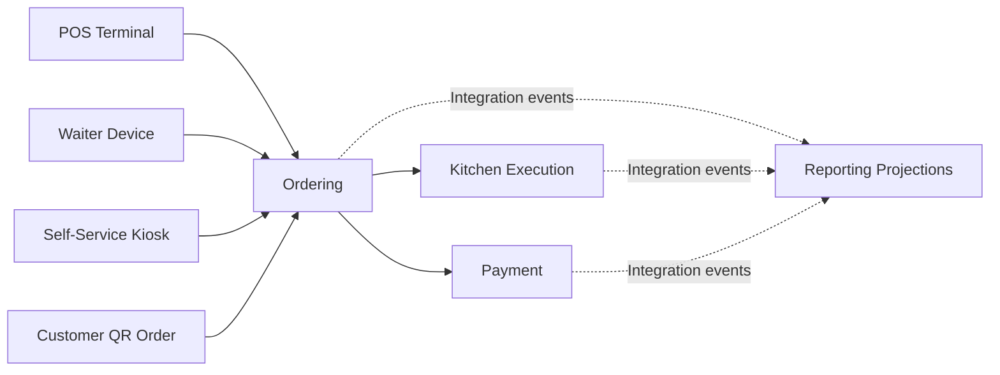
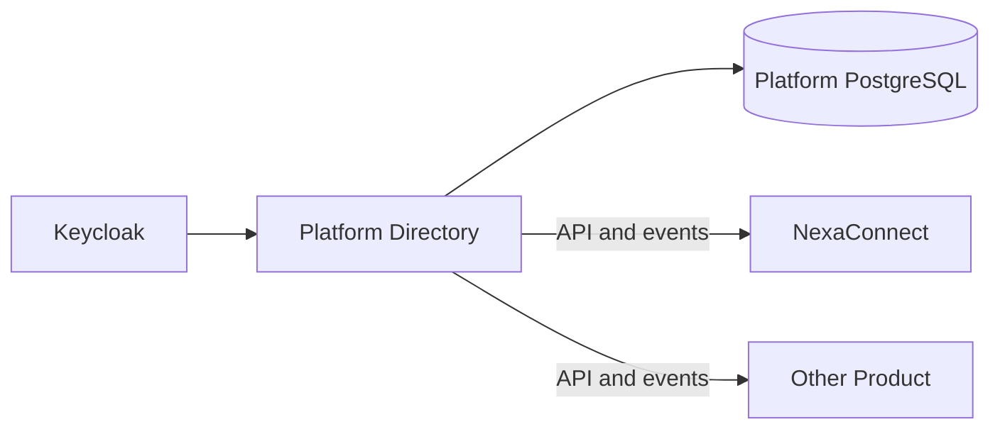

# NexaConnect Restaurant POS Architecture

The [five-scenario hosted Omise test-account gate passed on 2026-09-18](Evidence/Omise-Five-Scenario-Recovery-Acceptance.md), including pre-authorization token handoff. Payment implements opt-in signed test webhooks with migration-8 durable event-ID ingestion, authenticated canonical event validation and lease-fenced status-only recovery. The guarded real external-delivery/process-interruption gate passed on 2026-09-22 with disposable infrastructure, a Testing-only post-commit/pre-acknowledgement boundary, exact Payment termination, expired-lease restart and signed duplicate replay. Production enablement remains open. [ADR-010](Decisions/ADR-010-verified-omise-webhook-recovery.md) records the trade-offs. See [configuration, failure recovery and live acceptance](../Deployment/Omise-Webhooks.md).

Opt-in Development-only `card_omise_test` checkout now forwards a masked, transient test token from POS to Order and Payment. Pending intents without a token await a fresh operator token; retries use the original Order identity and contents. For an original pending checkout, POS enables token input only after Verify original order returns validated `cardTokenRequired=true`; that permission is memory-only and cleared on each attempt/session lock. Tokens never enter SQLite/outbox or durable workflow state. The opt-in five-scenario hosted Omise gate passed on 2026-09-18, including pre-authorization/token handoff. [Local POS Omise verification passed on 2026-09-18](Evidence/Omise-POS-Card-Acceptance.md) with operator-attested UI/OIDC/sign-out; the verifier does not independently inspect those interactions. Production browser card collection remains planned. [ADR-009](Decisions/ADR-009-ephemeral-test-card-token-handoff.md) records transient-token and explicit-recovery trade-offs. See the [configuration and acceptance guide](../Deployment/Omise-POS-Card-Token-Handoff.md).

The Payment Omise adapter supports test-account THB cards with ephemeral authorize input and conservative charge lookup/capture/reversal recovery. Opt-in Development-only POS/Order checkout now forwards transient test tokens for `card_omise_test`; production card collection and independent proof of UI interaction remain outside the operator-attested local POS pass recorded on 2026-09-18, and manual tender behavior is unchanged. Provider-backed PromptPay needs its own asynchronous flow. See [Omise scope](../Deployment/Omise-Test-Account-Acceptance.md).

The provider recovery gate now includes hosted pre-capture void recovery, duplicate delivery and paid-Order protection. Its five-scenario local hosted acceptance passed on 2026-09-17, including duplicate void delivery and cleanup; four-scenario hosted Omise execution passed on 2026-09-17; five-scenario Omise pre-authorization acceptance passed on 2026-09-18; production acceptance remains open. See [recovery scope, evidence and remaining release gates](Evidence/Phase-10-Order-Workflow-Recovery.md).

The WPF POS separates Checkout, Payment, Shift & cash, Cash review, and Terminal & sync. Terminal-bound SQLite schema 2 protects cashier operational/outbox payloads, exact retry identities, and a pending supervisor decision before network send. Active online sessions silently renew short-lived Keycloak credentials, lock authenticated actions after five minutes without operator input, and force interactive authentication at idle or the ten-hour absolute boundary without discarding operational recovery. POS-owned PostgreSQL supplies cashier/terminal reconciliation and version-fenced cash close. POS migration 5 adds exact-store closed-session history, a current review projection, and immutable supervisor decision history. Authorization migration 7 separates read from resolve access; decisions are idempotent and fence both financial and review versions, while late movements supersede older review. Late cash settlement atomically recalculates closed-session expected closing and variance values, and review reads derive those values from authoritative movements so legacy rows with a missing or stale expected total remain recoverable. Restart restores an uncertain supervisor request as a locked verification action and reconciles it against immutable history. Order migration 6 adds lease-fenced recovery of interrupted manual-tender workflows through KitchenAccepted while leaving Paid confirmation with the cashier; the guarded real-host process-interruption matrix passed on 2026-09-15. Order migration 7 extends the worker through provider payment using stable Payment intent idempotency, state-aware authorization/capture resumption, durable reconciliation, and Payment Review on exhausted uncertainty. Its guarded five-scenario runner now includes real Payment hosting, hosted recovery during RabbitMQ outage, durable outbox restart, and matching Order inbox verification; the complete local hosted-simulator matrix passed on 2026-09-16; four-scenario hosted Omise acceptance passed on 2026-09-17; five-scenario Omise pre-authorization acceptance passed on 2026-09-18; production acceptance remains a release gate. The upgraded cashier runner and joined OIDC/WPF cash checkout passed on 2026-09-10. The guarded local human Cash Review workflow passed on 2026-09-15 with accountant read-only access, manager decisions, restart verification, stale-client conflict, late-settlement invalidation, and clean sign-out. Fresh physical-terminal session-lock and supervisor acceptance, multi-store review/export, production cash-close Reporting acceptance, offline supervisor authorization/execution, and broader synchronization remain open. See the [POS cashier acceptance guide](../Deployment/POS-Cashier-Acceptance.md).

For the Bangkok MVP, cash and visually verified PromptPay settlement are Order-owned rather than Payment provider capture. The WPF Paid control requires explicit confirmation and a configured local QR plus verified reference for PromptPay. Its pending settlement file preserves the stable idempotency key and exact retry fields across a restart; uncertain outcomes are verified by identical replay rather than a new command. The optional POS migration-4 consumer applies `order.manual-tender-settled.v1` once against the event-time shift/session window. Cash posts one sale and late delivery reconciles historical variance; PromptPay creates no drawer movement. The safe event omits bank reference/operator identity.

## 1. Document status

This document records the business scope and architectural direction for NexaConnect before implementation. It intentionally separates confirmed requirements from decisions that still require validation.

NexaConnect is a restaurant operating platform with:

- Staff-operated point-of-sale terminals.
- Customer-operated touch-screen selling kiosks.
- A kitchen ordering and Kitchen Display System (KDS).
- Customer QR ordering from mobile browsers.
- Offline branch operation during internet or cloud outages.
- Synchronization after connectivity returns.
- Operational and management reporting.
- Authentication and authorization shared with other products through a separate identity platform.

The project will proceed through small, end-to-end vertical slices. Service boundaries, offline behavior, and data ownership must be agreed before implementing broad functionality.

## 2. Architectural priorities

1. **Restaurant operations continue during WAN outages** — order entry, kitchen routing, cash payment, and receipt printing must not depend on continuous internet access.
2. **One order model across channels** — POS, waiter devices, touch-screen kiosks, and QR ordering submit into the same Ordering capability.
3. **Local-first branch coordination** — POS terminals and kitchen displays coordinate over the restaurant LAN when cloud connectivity is unavailable.
4. **Reliable synchronization** — local operations use immutable identifiers, durable outboxes, acknowledgements, checkpoints, and idempotent cloud processing.
5. **Explicit ownership** — each capability owns its business rules and PostgreSQL data.
6. **Auditable financial operations** — payments, voids, discounts, refunds, cash movements, and offline privileged actions retain an immutable audit history.
7. **Read-optimized reporting** — reports use owned projections instead of cross-service operational queries.
8. **Shared identity without shared application coupling** — products share an OpenID Connect identity platform, not user tables or business authorization databases.

## 3. Ordering channels



Channel-specific request models may differ, but all accepted orders must enter one authoritative order lifecycle. Existing orders keep commercial snapshots of item names, modifiers, prices, discounts, service charges, and taxes. Kiosk is an ordering client and device type, not a separate owner of order business rules.

## 4. Business capability boundaries and bounded contexts

The capabilities below are the current NexaConnect bounded-context map. Each owns its ubiquitous language, domain model, persistence, and versioned integration contracts. They do not share domain entities or persistence models. Tactical Domain-Driven Design is applied according to the complexity of each capability, following [ADR-005](Decisions/ADR-005-domain-driven-design.md).

### 4.1 Restaurant Management

Owns restaurant tenants, branches, dining areas, tables, business hours, tax and service-charge configuration, preparation stations, and device registration policies.

### 4.2 Menu

Owns menus, categories, items, sizes, variants, modifier groups, modifier choices, prices, availability, sold-out state, preparation-station assignment, and product-image associations.

The existing `Catalog` project is the provisional implementation home for this capability. A rename to `Menu` should be decided before business code makes the original name expensive to change.

### 4.3 Ordering

Owns dine-in, takeaway, kiosk, and QR orders; order lines; modifiers; guest counts; commercial snapshots; discounts; service charges; taxes; lifecycle transitions; cancellations; and void requests.

### 4.4 Kitchen Execution

Owns kitchen tickets, preparation routing, station queues, item-level preparation state, ticket state, reprints, preparation timing, and kitchen audit history.

Ordering owns what was purchased. Kitchen Execution owns how accepted items are prepared. `OrderSubmitted` or an equivalent event creates kitchen work; a notification service must not substitute for the Kitchen capability.

### 4.5 POS Operations

Owns POS terminals and kiosks, shifts, cash sessions, cash movements, receipt numbering, device enrollment and health, local synchronization state, device commands, and operation acknowledgements.

It also owns cash-session variance review. Closed sessions are listed only after Restaurant hierarchy and POS store ownership match the exact organization/restaurant/branch/store scope. Zero variance is balanced; nonzero variance is review required until an authorized supervisor investigates or approves the current financial version. Current state and append-only actor/reason/Authorization-decision history commit in one POS transaction. A late cash settlement advances the financial version and atomically recalculates expected closing and variance without erasing the older decision. Review queries derive expected closing from the opening balance and immutable movements, which repairs the read model for older closed rows whose stored expected value is absent or stale. Review decisions do not mutate totals or cross a service database boundary.

### 4.6 Payment

Owns payment intents, authorization/capture/void state, cash payments, card-provider references, split payments, tips, refunds, reconciliation, and payment idempotency. Authorization, capture recovery, and durable void recovery are implemented. Void is trusted-Order-only, accepts authorized and uncaptured intents, persists bounded PostgreSQL recovery state, and never repeats an uncertain provider command. Order migration 3 consumes void events durably: confirmed void compensates unpaid work, uncertainty retains work, failure/exhaustion enters `payment_review`, and paid orders remain immutable. Delayed capture policy, refunds, and settlement remain planned.

Order migration 4 provides the online operator boundary for those review cases. Tenant/restaurant-scoped managers use dedicated read/resolve permissions, while branch-scoped accountants have read-only review access after Authorization migration 5; all decisions still require exact hierarchical organization/branch authorization. Resolvers use an expected version and a fenced two-minute decision lease. Confirmed void, resumed payment reconciliation, or escalation appends actor/reason/Authorization-decision history and publishes safe resolution/audit events atomically with the Order transition. The Customer Portal now provides branch-scoped review details, the latest 100 committed decisions, and CSRF-protected confirmation through the Customer BFF. Confirm void requires independently verified payment evidence; the UI does not query the provider or introduce offline approval. Joined live identity/BFF/Order operator acceptance remains a release gate; see [operator workflow](../API/Payment-Review-Operator-UI.md).

Cash can normally be accepted offline. Card payments may be accepted offline only when the payment terminal and provider explicitly support an approved store-and-forward workflow.

### 4.7 Inventory

Owns ingredients or stock items, storage locations, balances, movements, reservations, recipes or depletion rules where required, adjustments, and replenishment.

The exact boundary between recipe management in Menu and stock depletion in Inventory requires a dedicated domain decision.

### 4.8 Customer

Owns optional customer profiles, contact preferences, loyalty identity, and customer-specific restaurant information. Anonymous QR ordering must not require creation of a permanent customer profile.

The implemented profile-creation boundary is tenant-authorized and conflict-safe. PostgreSQL first creation atomically appends audit that excludes profile fields and publishes identifier/status-only lifecycle plus audit contracts; matching and concurrent retries do not republish. Names, profile identity subjects, contacts, addresses, preferences, and attributes remain Customer-owned and are excluded from Reporting audit payloads. A restricted actor subject is retained for accountability. Status transitions and detailed profile subresources remain planned.

### 4.9 Media

Owns upload lifecycle, image metadata, processing state, generated variants, and object-storage keys. Image files remain in MinIO or S3-compatible object storage.

### 4.10 Reporting

Owns read-optimized projections for sales, payments, tax, shifts, cash, items, categories, order channels, cancellations, voids, and kitchen performance.

Reporting consumes integration events and does not become the owner of operational business facts.

## 5. Branch-resilient deployment model

The recommended topology includes an always-on branch edge service inside each restaurant. This remains a proposed decision until branch hardware and support expectations are confirmed.

```mermaid
flowchart TB
    subgraph Cloud[Cloud platform]
        CLOUDAPI[Cloud Services]
        CLOUDDB[(Service-owned PostgreSQL Databases)]
        REPORTING[Reporting Projections]
        IDP[Shared Identity Platform]
    end

    subgraph Branch[Restaurant local network]
        EDGE[Branch Edge Service]
        EDGEDB[(Durable Local Store)]
        POS1[POS Terminal]
        POS2[POS Terminal]
        KIOSK[Self-Service Kiosk]
        KDS[Kitchen Display]
        DEVICES[Printers and Local Devices]

        POS1 --> EDGE
        POS2 --> EDGE
        KIOSK --> EDGE
        KDS --> EDGE
        EDGE --> DEVICES
        EDGE --> EDGEDB
    end

    EDGE <-->|Outbox, synchronization and acknowledgements| CLOUDAPI
    CLOUDAPI --> CLOUDDB
    CLOUDAPI -. Events .-> REPORTING
    CLOUDAPI -. OIDC and OAuth 2.0 .-> IDP
```

The edge service should coordinate branch ordering and kitchen work over the LAN. Each POS terminal and kiosk should also retain a local SQLite outbox so brief device-to-edge failures do not lose an accepted operation.

## 6. Offline failure model

Offline behavior must be specified separately for each failure mode.

| Failure mode | Required behavior |
| --- | --- |
| WAN or cloud unavailable; branch LAN operational | POS, KDS, cash payments, and printing continue through the branch edge service. Operations queue for cloud synchronization. |
| POS temporarily disconnected from branch LAN | The terminal records allowed operations in local SQLite and forwards them when the edge connection returns. |
| Kiosk temporarily disconnected from branch LAN | The kiosk stops or limits new checkout according to policy, preserves accepted operations locally, and forwards them when the edge connection returns. |
| Branch edge service unavailable | The allowed terminal fallback scope must be explicitly defined; multi-terminal and kitchen coordination will be degraded. |
| Shared identity platform unavailable | Previously enrolled users may use controlled offline sessions within a configured grace period. New enrollment and sensitive operations may require connectivity. |
| Payment provider unavailable | Cash continues; card behavior follows provider-certified offline policy. |
| Cloud reporting unavailable | Branch operations continue; report projections catch up from retained events after recovery. |

## 7. Synchronization contract

Every locally accepted command must include:

- A globally unique operation identifier generated by the originating device.
- Restaurant tenant and branch identifiers.
- Terminal, user, and shift identifiers where applicable.
- A business timestamp and a device-recorded timestamp.
- The command type and contract version.
- An idempotency key appropriate to the operation.

Synchronization rules:

- Local operations are stored durably before success is shown to the operator.
- Successfully committed local operations enter an outbox in the same transaction.
- Cloud consumers process each operation identifier at most once from the business perspective.
- The cloud returns explicit acknowledgements and rejection reasons.
- Checkpoints advance only after acknowledged processing.
- Retried operations must return the original outcome rather than creating duplicate orders or payments.
- Financial conflicts are never resolved using generic last-write-wins behavior.
- Rejected or conflicting operations remain visible for operational resolution and audit.
- Local records and outbox entries are retained until acknowledgement and the configured retention period are satisfied.

## 8. Primary restaurant workflow

The first executable workflow is:

```text
Open shift
→ Create dine-in order
→ Select table and guest count
→ Add menu items and modifiers
→ Submit order
→ Route items to kitchen stations
→ Mark items queued, preparing, and ready
→ Accept cash payment
→ Print receipt
→ Synchronize after a simulated WAN outage
→ Produce a daily sales and kitchen-time report
```

The Catalog/Menu → Order → Inventory → Kitchen → Payment portion is implemented by the Order application workflow. Kitchen owns queued/in-progress/ready/completed/cancelled ticket transitions, exact Order creation/compensation, tenant operator authorization, append-only history/audit, and transactional lifecycle publication. The online ticket-level [Kitchen queue](../API/Kitchen-Queue.md) exposes active branch/station work and version-fenced Start/Ready/Complete controls through the Customer BFF. Preparation remains independent of payment; completed tickets block whole-order cancellation and require operational investigation. [ADR-011](Decisions/ADR-011-online-kitchen-queue.md) records this limited browser surface. Canonical station identity, item-level preparation, dedicated KDS hardware, and LAN/offline execution remain planned.

## 9. Kitchen execution rules

- Kitchen tickets are derived from accepted order changes, not directly from mutable menu data.
- Items are routed by preparation station, such as kitchen, bar, dessert, or expediter.
- An order may produce multiple station tickets while remaining one commercial order.
- Quantity changes, voids, and additions after submission create explicit kitchen adjustments.
- Ticket and item status transitions are append-only or fully audited.
- Duplicate delivery of an order event must not create duplicate kitchen work.
- KDS state must continue over the restaurant LAN during a WAN outage.

## 10. QR ordering

The QR token identifies a restaurant branch and normally a table or ordering context. It must be opaque, revocable, and protected against guessing or cross-branch use.

A customer QR flow normally includes:

1. Scan table QR code.
2. Resolve restaurant, branch, and table context.
3. Load the active menu and current availability.
4. Build a cart with modifiers.
5. Submit an order or request staff approval according to restaurant policy.
6. Pay online, pay at the counter, or add to the table account according to policy.
7. Receive order status without gaining access to other table orders.

Cloud QR ordering becomes unavailable when the restaurant loses internet access unless customers join restaurant Wi-Fi and a secure local ordering endpoint is provided. Local offline QR support therefore requires an explicit networking, DNS, TLS, guest-Wi-Fi, and threat-model decision.

## 11. Touch-screen kiosk selling

The self-service kiosk is a branch-enrolled ordering client that uses the shared Menu, Ordering, Kitchen, Payment, POS Operations, and Reporting capabilities.

A normal kiosk flow is:

1. Start a new anonymous customer session.
2. Choose language, order type, and dine-in or takeaway context.
3. Browse the branch menu, availability, modifiers, and prices.
4. Build and review the order.
5. Submit payment or select an allowed pay-at-counter flow.
6. Send the accepted order into the same Ordering and Kitchen lifecycle as other channels.
7. Print or display the receipt and collection number.
8. Clear all customer-session data before returning to the welcome screen.

Kiosk requirements:

- Large, accessible touch targets and supported languages.
- Locked-down operating-system kiosk mode.
- Automatic customer-session timeout and privacy clearing.
- Device authentication separate from customer identity.
- Staff maintenance and manager override authentication.
- Payment-terminal and optional receipt-printer adapters behind interfaces.
- Local menu and availability cache with version and freshness indicators.
- Globally unique operation identifiers and a durable local outbox.
- Explicit behavior when the edge service, kitchen, printer, or payment provider is unavailable.

The implementation platform remains undecided. A Windows-native client is appropriate when deep payment-terminal, printer, scanner, or device-control integration is required. A browser or PWA remains an option for simpler hardware profiles.

## 12. Reporting architecture

Operational recovery now includes a manifest-pinned retained-event replay CLI and POS-7 append-only run/attempt audit. Original snapshot identities and source cash/checkpoints remain unchanged. The disposable process/broker recovery runner and backlog/retry alerts are implemented; local Windows recovery/restricted replay and synthetic alert evaluation passed on 2026-09-24. Remote CI, production acceptance and receiver delivery remain release gates. See [evidence](Evidence/Cash-Close-Recovery-Acceptance.md). See [recovery procedure and authority](../Deployment/Cash-Close-Recovery.md).

The implemented [single-store cash-close report](../API/Cash-Close-Reporting.md) projects current closed-session financial/review snapshots through an opt-in POS outbox and separate Reporting consumer. POS remains authoritative for movements and decisions; late settlement can replace approval with `review_required`. The projection coalesces intermediate changes and is not complete decision history or end-of-day settlement evidence. Every read checks live exact-store POS access. Capture/projection times are row provenance, not a completeness watermark. [ADR-012](Decisions/ADR-012-cash-close-snapshot-reporting.md) records the boundary; production acceptance, exports, multi-store totals and offline reporting remain open.

Operational services publish versioned facts such as:

- `OrderOpened`
- `OrderSubmitted`
- `OrderLineAdded`
- `KitchenItemStarted`
- `KitchenItemReady`
- `PaymentCompleted`
- `OrderVoided`
- `ShiftOpened`
- `ShiftClosed`
- `CashMovementRecorded`

Cloud reporting consumes these events into a dedicated read store. Reports are eventually consistent and expose their data freshness. Branch-local reports required during an outage use the edge store and clearly identify unsynchronized data.

Initial reporting scope:

- Daily sales by branch, terminal, employee, channel, and payment method.
- Tax, service charge, discount, refund, cancellation, and void summaries.
- Item, category, modifier, and time-period performance.
- Shift and cash reconciliation.
- Kitchen queue time, preparation time, and completion time.
- Comparison of POS, waiter, kiosk, and QR ordering channels.

## 13. Shared identity and authorization

Keycloak is the proposed shared identity platform for NexaConnect and other products. Sharing occurs through OpenID Connect and OAuth 2.0 contracts, not through direct access to Keycloak tables or another application's authorization database.

A separately owned Platform Directory provides shared organization identity, common identity-to-organization membership, registered applications, and organization-level application access when those records are required across products. NexaConnect and other products consume that information through versioned APIs and events; they do not share the Platform Directory's tables.



The identity platform owns authentication, common user identity, credentials, and shared organization membership. NexaConnect owns restaurant-specific authorization such as:

- Branch access
- Terminal enrollment
- Applying discounts
- Voiding orders
- Opening and closing shifts
- Issuing refunds
- Viewing financial reports
- Performing manager overrides

Each product receives separate identity clients and resource scopes. Shared claims require a versioned contract and stable identifiers.

Offline authorization requires prior online enrollment, cached validated permissions, a configurable grace period, local PIN or device-assisted unlock where appropriate, and an audit record for every privileged offline action. High-risk actions may require connectivity or a manager override according to policy.

The branch edge stores only a minimal local projection: identity subject, organization, restaurant and allowed branches, employee profile, effective permissions, enrollment time, expiry, and last synchronization time. Revocation and suspension events must be applied idempotently when connectivity is available.

The accepted cross-product ownership decision is recorded in [ADR-002](Decisions/ADR-002-shared-platform-data-ownership.md).

## 14. Administration dashboards

Administration is separated into a cross-product control plane and independently deployed product dashboards.

### Platform Admin Dashboard

The shared platform owns a Platform Admin Dashboard for organizations, common memberships, registered products and websites, organization-level product access, shared reference data, platform support, and approved ecosystem-level reporting. It accesses Platform Control Plane APIs and does not connect directly to product databases.

The Platform Admin Dashboard does not manage restaurant menus, orders, kitchen tickets, payments, shifts, or detailed restaurant reports.

For initial tenant onboarding only, its BFF may invoke narrowly scoped Restaurant-owned APIs to bootstrap a restaurant and branch and an Authorization-owned API to assign the first product administrator. Ongoing restaurant configuration and operations remain in `NexaConnect.Admin`; this bootstrap path does not transfer product ownership to the shared platform.

### NexaConnect Admin Dashboard

NexaConnect owns `NexaConnect.Admin`. It manages restaurant-specific configuration and operations, including restaurants, branches, employees, menus, modifiers, tables, QR codes, POS terminals, kiosks, kitchen displays, preparation stations, shifts, cash, inventory, payments, and restaurant reporting.

Future products own separate administration dashboards and product APIs. A property-listing dashboard, for example, owns property listings, agents, media, approvals, inquiries, and property reporting without depending on NexaConnect.

The ecosystem uses separate portal trust boundaries. `platform-admin-bff` serves the shared Product Owner Portal, `nexaconnect-admin-bff` serves NexaConnect product administration, and the current `nexaconnect-web-bff` serves the tenant-scoped Customer Portal. Each has a separate OIDC client and BFF session boundary. Platform roles do not automatically grant restaurant operational permissions. Platform Directory now implements reasoned, independently approved, time-limited, revocable, and audited support elevation for controlled cross-boundary access; product services still perform their own resource authorization.

Platform reporting contains approved ecosystem summaries. Detailed restaurant reporting remains inside NexaConnect. The accepted dashboard separation is recorded in [ADR-003](Decisions/ADR-003-platform-and-product-dashboard-separation.md).

## 15. Data and media direction

- PostgreSQL is the transactional database technology.
- Each cloud service owns its PostgreSQL database or isolated schema and credentials.
- Schema-first PostgreSQL migrations are the source of truth, with paired and tested upgrade and downgrade paths for every released version.
- Application releases declare required schema versions per service and prefer expand-and-contract compatibility for rollback.
- PostgreSQL `jsonb` is used only for flexible attributes with clear ownership.
- POS terminals use schema-versioned SQLite for terminal-bound local state and durable outboxes. Sensitive payloads remain protected for the current Windows user.
- The branch edge service requires a durable local store; PostgreSQL versus SQLite remains a deployment decision.
- MinIO is used for local image development and S3-compatible object storage for production.
- RabbitMQ carries asynchronous cloud integration events and image-processing work.
- MongoDB is added only if a bounded context develops a justified complex document workload.

Detailed logical database guidance is in [Database Design](../Database/Database-Design.md).
The accepted migration decision is recorded in [ADR-001](Decisions/ADR-001-schema-first-versioned-migrations.md).

## 16. Testing implications

The system requires tests beyond ordinary API coverage:

- WAN interruption during order submission and payment.
- Duplicate, delayed, and out-of-order messages.
- Terminal restart with unsynchronized operations.
- Edge restart with pending outbox entries.
- Cloud rejection and conflict handling.
- Duplicate kitchen-event delivery.
- Menu or price changes while a branch is offline.
- Shift close with unsynchronized transactions.
- Identity-provider outage during an active shift.
- Reporting replay and projection rebuild.
- QR token tampering and cross-table access attempts.
- Kiosk session timeout and customer-data clearing.
- Kiosk restart with an accepted but unsynchronized order.
- Duplicate kiosk checkout and payment callbacks.
- Kiosk behavior during edge, printer, kitchen, and payment-provider failures.
- Touch accessibility, supported resolution, and locked-down device behavior.
- Platform administrators cannot access restaurant operations without explicit product authorization.
- Product administrators cannot access Platform Control Plane functions without platform authorization.
- Dashboard cookies, audiences, scopes, logout, and support-elevation expiry remain isolated.

## 17. Decisions required before implementation

1. Whether every branch will have a supported always-on edge computer.
2. Required behavior when the edge computer itself is unavailable.
3. Whether QR ordering must operate during a WAN outage.
4. Supported payment types and provider-certified offline card behavior.
5. Tenant, restaurant, branch, employee, and role model shared with the other product.
6. Whether KDS runs in a browser, installed application, or dedicated appliance.
7. Branch hardware targets, operating system, database, backup, and update mechanism.
8. Source-of-truth and resolution policy for each synchronizable entity.
9. Reporting freshness, retention, export, and regulatory requirements.
10. Fiscal receipt, tax, privacy, and audit requirements for target countries.
11. Kiosk operating system and native application versus browser/PWA delivery.
12. Kiosk payment methods, payment-terminal model, printer, scanner, and cash hardware.
13. Kiosk dine-in, takeaway, table-selection, collection-number, accessibility, and language requirements.
14. Platform Dashboard hosting domain, navigation, and cross-product summary contracts.
15. Whether restaurant owners and internal NexaConnect product operators use role-specific views in one product dashboard or separately deployed portals.

No implementation decision should silently resolve these items. Each material decision should be recorded as an Architecture Decision Record.
