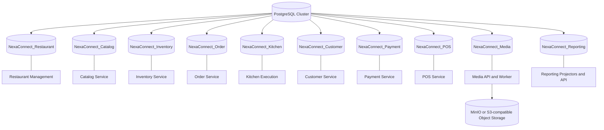
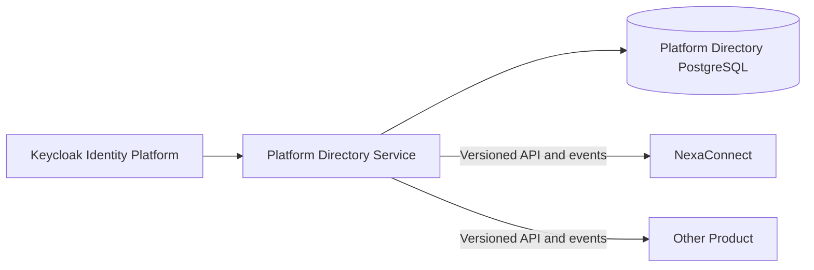

# NexaConnect Database Design

Platform Directory owns `organization_memberships`. Customer membership mutations lock existing rows for optimistic concurrency and require the current `concurrency_version` for updates. The membership mutation and its `customer-membership.changed` append-only audit row commit in one transaction. Keycloak subject identifiers are stored; credentials are not.

Restaurant migration 2 adds append-only `branch_management_audit`; migration 3 permits `branch.configuration.updated`. Typed settings remain in `branches.business_configuration`. Lifecycle and configuration writes share `branches.concurrency_version`, exclude closed branches, and commit audit insertion in the same transaction. Rollback to migration 2 removes acceptance of the configuration audit action.

## 1. Purpose

This document defines the initial logical and physical database baseline for NexaConnect. It covers PostgreSQL ownership, schema naming, migrations, sample-data generation, integration-event reliability, and media metadata.

The design will evolve with the domain model. Every schema change must remain owned by one business service and must be delivered through an immutable migration.

### 1.1 Baseline status

Versioned migrations exist for 13 independently owned databases: Platform Directory, Authorization, Restaurant, Catalog, Inventory, Order, Kitchen, Customer, Payment, Notification, POS, Media, and Reporting. Catalog version 3, Inventory version 4, and Payment version 2 add explicit organization columns and tenant-leading keys/indexes to simplified service tables used by customer APIs. Payment version 3 adds authorization state, version 4 adds recoverable leases/reconciliation, and version 5 adds capture state plus sanitized provider capture references. Catalog, Inventory, Customer, and Payment version 1 own their transactional outbox state; later product-integration migrations add append-only audit and preserve those outboxes on downgrade. Each migration has metadata and paired upgrade and downgrade scripts.

POS version 1 owns `sync_operations` and `sync_checkpoints` in addition to stores, terminals, shifts, cash sessions, cash movements, and its outbox. The first server-side synchronization behavior uses `sync_operations` for terminal-scoped cash-movement replay dedupe: terminal and shift-subject ownership are checked before mutation, the operation marker and movement insert commit in one PostgreSQL transaction, exact and concurrent retries are accepted without another movement row, failed movement insertion rolls back the marker, and mismatched payload reuse is rejected.

Catalog version 3 and Inventory version 4 temporarily assign the empty UUID to pre-existing simplified-service rows because those legacy tables did not retain an organization identifier. Before enabling customer traffic, operators must backfill each row from the authoritative Restaurant branch scope and verify that no two organizations would collapse to the same legacy key. Downgrade is permitted only after the same collision check; otherwise the former branch/product or order/product primary key cannot be restored safely.

Catalog version 1 creates `outbox_messages` and its unpublished-message polling index. Version 4 adds `catalog_audit_records`, protected from update and delete by a database trigger. A PostgreSQL menu-item upsert, its audit row, and both versioned outbox messages commit in one transaction. The version-4 downgrade drops only the audit objects and preserves the outbox and undispatched publication history; producers must still be stopped because version-3 application code cannot create the audit records expected by the current mutation path.

Static validation has confirmed metadata parsing, create/drop parity, PostgreSQL identifier lengths, output packaging, and a clean migration-project build. The migration executable now understands versioned directories and explicit target versions. Catalog has opt-in isolated-schema migration-4 coverage and implemented full-database runner acceptance for 0→4→3→4. Inventory's complete seven-test acceptance passed locally against PostgreSQL 17 and RabbitMQ. Its full-database case invokes the actual runner for 0→5→4→5, validates checksums and representative objects from migrations 1-5, proves migration-5 downgrade preservation, and exercises repository writes before and after re-upgrade. Catalog's configured administrator password remains stale; Inventory used a generated temporary administrator and database that were removed after the successful run. Successful live runner evidence remains required for Catalog and the other unaccepted service catalogs before production execution.

Payment's intent-creation acceptance and Reporting migration-4 vocabulary persistence previously passed locally against PostgreSQL 17 and RabbitMQ. Payment migrations 3-4 and Reporting migrations 8-9 add authorization lifecycle, recoverable lease, uncertainty, and reconciliation persistence/projection; Payment migration 5 and Reporting migration 10 add capture state, sanitized references, and capture projection vocabulary. Updated opt-in PostgreSQL authorization/capture and 0→5→1→5 runner cases require fresh release evidence. Production legacy backfill still requires authoritative Order ownership reconciliation, and production payment processing additionally requires provider-environment authorization/capture recovery evidence.

Kitchen migration 3 adds organization attribution, conflict fingerprints, station-distinct tenant uniqueness, append-only audit, and append-only protection for migration-1 status history while preserving migration-1 outbox and migration-2 inbox ownership. Legacy rows require Order-backed reconciliation. Kitchen 0→3→2→3 and Reporting migration-5 projection/replay passed against local PostgreSQL 17; RabbitMQ recovery confirmed Kitchen lifecycle/audit publication over a new connection.

Authorization migration 3 backfills `kitchen.ticket.read` and `kitchen.ticket.transition` for existing `tenant-admin` and `store-manager` role assignments. It adds no tables or indexes; downgrade removes only those permission associations. Opt-in runner acceptance seeds pre-existing roles and verifies the 2→3→2 backfill/removal behavior in a disposable PostgreSQL database.

Customer migration 2 adds append-only audit that excludes profile fields while migration 1 remains the outbox owner. The audit retains a restricted actor subject for accountability. First creation transactionally persists one profile, one audit row, and `customer.profile-created.v1`/`customer.audit.v1`; matching retries do not republish. Reporting migration 6 accepts and replay-protects Customer audit vocabulary. Six coordinated PostgreSQL 17/RabbitMQ acceptances passed locally, including concurrent replay, atomic rollback, confirmed recovery publication, Reporting replay, and Customer 0→2→1→2. Generated acceptance infrastructure was removed afterward.

POS cash replay has seven successful isolated-schema PostgreSQL 17 tests. They prove exact/concurrent operation deduplication, rollback of the sync marker when movement insertion fails, terminal and shift-subject denial, active terminal scoping, shift persistence/concurrency, and duplicate-open conflict. Each test creates and removes its own schema. The full POS migration acceptance invokes the actual runner for 0→3→2→3 in a generated `nexaconnect_pos_clean_it_<guid>` database, validates immutable checksums/history and migration-3 close-authorization objects, proves migration-1 replay/cash rows survive the safe downgrade, exercises real shift/cash repositories before and after re-upgrade, and removes the database afterward. It passed locally against PostgreSQL 17.

## 2. Database topology

PostgreSQL is the standard transactional database technology. A single PostgreSQL cluster is acceptable for the initial deployment, but each service must have an independently owned database, role, connection string, migrations, and backup policy.



Services must not query, update, or create foreign keys against another service database. Cross-service data is obtained through APIs, integration events, or service-owned read projections.

### 2.1 Cross-product platform boundary

Shared authentication and organization data is not stored in a database directly shared by NexaConnect and other products.



Keycloak owns credentials and stable identity subject identifiers. A separately owned Platform Directory stores shared organizations and memberships when they are required across products. NexaConnect stores stable `identity_subject_id` and `organization_id` values without cross-database foreign keys.

The accepted ownership boundary is defined by [ADR-002](../Architecture/Decisions/ADR-002-shared-platform-data-ownership.md).

### 2.2 Database provisioning

Cluster-level provisioning is separate from service schema migration. Provisioning creates databases, login roles, ownership, connection permissions, and default runtime privileges. Versioned service migrations create tables, constraints, indexes, comments, and migration history inside an existing database.

Local Docker provisioning is implemented by [`docker/postgres/init/001_create_nexaconnect_databases.sh`](../../docker/postgres/init/001_create_nexaconnect_databases.sh). On the first start of an empty PostgreSQL volume it creates all 13 catalog databases, a `nexaconnect_migration` DDL owner, and a restricted runtime login for each database.

Initialization does not apply schema migrations and does not rerun for an existing data volume. Production environments must implement the same ownership boundary through infrastructure as code and managed secrets rather than relying on the local initializer.

## 3. Database and role allocation

| Business capability | Database | Owning runtime | Suggested role |
| --- | --- | --- | --- |
| Shared organization directory | `PlatformDirectory` | Platform Directory Service | `platform_directory_app` |
| Product authorization | `NexaConnect_Authorization` | Authorization Service | `nexaconnect_authorization_app` |
| Restaurant Management | `NexaConnect_Restaurant` | Restaurant Management Service | `nexaconnect_restaurant_app` |
| Menu | `NexaConnect_Catalog` | Catalog Service, provisionally | `nexaconnect_catalog_app` |
| Inventory | `NexaConnect_Inventory` | Inventory Service | `nexaconnect_inventory_app` |
| Order | `NexaConnect_Order` | Order Service | `nexaconnect_order_app` |
| Kitchen Execution | `NexaConnect_Kitchen` | Kitchen Service | `nexaconnect_kitchen_app` |
| Customer | `NexaConnect_Customer` | Customer Service | `nexaconnect_customer_app` |
| Payment | `NexaConnect_Payment` | Payment Service | `nexaconnect_payment_app` |
| Notification | `NexaConnect_Notification` | Notification Service | `nexaconnect_notification_app` |
| POS | `NexaConnect_POS` | POS Service | `nexaconnect_pos_app` |
| Media | `NexaConnect_Media` | Media API and Worker | `nexaconnect_media_app` |
| Reporting | `NexaConnect_Reporting` | Reporting Projectors and API | `nexaconnect_reporting_app` |

Notification durable delivery state is owned by the separately provisioned `NexaConnect_Notification` database; other services do not access it directly.

Notification migration 2 adds the organization-leading `organization_id`, unique optional `source_event_id`, append-only `notification_audit_records`, lease-based `inbox_messages`, and `outbox_messages`. Migration 3 adds status/timestamp/concurrency fields for submission and receipt leases, opaque provider references, bounded error categories, and append-only `notification_delivery_attempts`. Due and provider-reference indexes support worker claims and receipt identity. Queue creation and each accepted/delivered/failed lifecycle mutation commit their local state, audit, attempts, and outbox records atomically. Recipient and body columns are restricted delivery data and never belong in audit or integration payloads. Authorization migration 2 backfills `notification.read` and `notification.send` on existing tenant-admin/store-manager role definitions; effective access still follows each assignment's organization/restaurant scope.

Application roles must not own the databases. Use a separate migration role for DDL operations and grant application roles only the permissions needed at runtime.

Restaurant hierarchy provisioning is performed by the Restaurant API and its Infrastructure repository; Platform Admin BFF never writes Restaurant tables. Product-role provisioning follows the same ownership rule through Authorization. Authorization migration 1 already models nullable hierarchical resource scopes with `UNIQUE NULLS NOT DISTINCT`: tenant administrators use organization scope, store managers use restaurant scope, and operational roles use branch scope. The development provisioning routes are idempotent by restaurant organization/code, branch restaurant/code, and role assignment scope; this correction requires no new database migration.

Runtime roles must not read or modify `nexaconnect_schema_migrations`. The migration runner revokes inherited runtime access after creating or verifying its history table.

### 3.1 Platform Directory logical tables

The Platform Directory is outside NexaConnect's restaurant service databases. Its initial schema-first logical model is:

#### `organizations`

- `id uuid` — stable cross-product organization identifier.
- `code text` — immutable or carefully governed business code.
- `name text` — display name.
- `status text` — pending, active, suspended, or closed.
- `default_time_zone text` — organization default, overridden by restaurant branches where needed.
- Standard creation and update audit columns.

#### `organization_memberships`

- `id uuid` — membership identifier.
- `organization_id uuid` — owned foreign key to `organizations` inside the Platform Directory database.
- `identity_subject_id text` — stable Keycloak subject identifier, not a database foreign key.
- `status text` — invited, active, suspended, or removed.
- `joined_at_utc timestamptz` and membership audit timestamps.

The combination of `organization_id` and `identity_subject_id` must be unique for an effective membership according to the selected history model.

#### `applications`

- `id uuid` — platform application identifier.
- `code text` — stable unique code such as `nexaconnect-pos`.
- `name text` and `status text`.

#### `organization_application_access`

- `organization_id uuid` and `application_id uuid`.
- `status text` — enabled, suspended, or disabled.
- `enabled_at_utc timestamptz` and `disabled_at_utc timestamptz`.

The version-1 baseline creates this table to support platform-level product enablement. Product-specific roles and permissions do not belong here.

#### `support_elevations`

- Scoped to one support subject, organization, and registered application.
- Stores the required reason, requested duration, independent approver, absolute expiry, revocation state, and lifecycle timestamps.
- Effective access requires active status, no revocation, and `expires_at_utc` later than the current time.

#### `support_elevation_audit`

- Append-only request, approval, and revocation actions.
- Stores the elevation identifier, action, actor subject, and occurrence timestamp.
- A database trigger rejects row updates and deletes, including accidental mutation through the normal runtime credential.

### 3.2 Dashboard data access

The Platform Admin Dashboard reads and changes platform data only through Platform Control Plane APIs. Product dashboards read and change product data only through their product gateways and APIs. Dashboards never connect directly to PostgreSQL.

Cross-product dashboard summaries use explicitly published metrics, APIs, or reporting events. Platform reporting must not query or join product operational databases. Detailed NexaConnect reports remain owned by the NexaConnect Reporting capability.

Dashboard separation and identity-client boundaries are defined by [ADR-003](../Architecture/Decisions/ADR-003-platform-and-product-dashboard-separation.md).

## 4. Naming conventions

- Use `snake_case` for schemas, tables, columns, indexes, and constraints.
- Use plural table names, such as `products` and `order_lines`.
- Name primary keys `id` and foreign-key columns `<entity>_id`.
- Name primary keys `pk_<table>`.
- Name foreign keys `fk_<table>_<referenced_table>_<column>`.
- Name unique constraints `uq_<table>_<columns>`.
- Name indexes `ix_<table>_<columns>`.
- Use unquoted PostgreSQL identifiers.
- Use UTC and PostgreSQL `timestamptz` for instants.

## 5. Common column standards

These are conventions, not a requirement for every table:

| Purpose | PostgreSQL type | Notes |
| --- | --- | --- |
| Entity identifier | `uuid` | Generate outside the database when offline creation or idempotent retries are required. |
| Tenant identifier | `uuid` | Include in tenant-scoped unique constraints and indexes. |
| Store identifier | `uuid` | Required on store-scoped operational records. |
| Timestamp | `timestamptz` | Store UTC instants. |
| Money amount | `numeric(19,4)` | Never use floating-point types for money. |
| Currency | `char(3)` | ISO 4217 code validated by the application or a reference table. |
| Flexible attributes | `jsonb` | Use only for attributes without stable relational structure. |
| Concurrency token | `bigint` | Increment on updates when application-managed optimistic concurrency is required. |
| External idempotency key | `text` | Scope with tenant, operation type, or provider as appropriate. |

Typical audit columns are `created_at_utc`, `created_by`, `updated_at_utc`, and `updated_by`. Use explicit lifecycle states instead of applying generic soft deletion to every table.

### 5.1 Shared technical table conventions

The following table designs may be standardized as templates, but each service database owns a separate physical copy:

| Convention | Physical ownership |
| --- | --- |
| `nexaconnect_schema_migrations` | One history table per service database |
| `outbox_messages` | One outbox per event-publishing service |
| `inbox_messages` or `processed_messages` | One deduplication store per consuming service |
| `idempotency_records` | One store per service requiring request deduplication |
| Audit records | Owned by the service that performs the audited business action |
| Synchronization operations | Owned by POS or branch-edge capabilities |

Sharing SQL templates does not grant one service permission to read or write another service's technical tables.

## 6. Initial schema model

The following summaries describe the implemented version-1 ownership model. The SQL under `src/Tools/NexaConnect.DataMigration/Scripts` is authoritative when a summary differs from a physical column, constraint, or index.

| Database | Version-1 tables | Notes |
| --- | ---: | --- |
| PlatformDirectory | 8 | Organizations, memberships, applications, access, outbox, support elevation/audit, and append-only platform administration audit |
| Restaurant | 7 | Restaurant structure, operating configuration, and outbox |
| Catalog | 20 | Menu, modifiers, pricing, availability, routing, media links, and outbox |
| Inventory | 7 | Stock locations, balances, ledger, reservations, replenishment, inbox, and outbox |
| Order | 9 | Orders, snapshots, lifecycle, returns, idempotency, and outbox |
| Kitchen | 8 | Tickets, items, lifecycle, adjustments, processed/inbox state, outbox, and append-only audit |
| Customer | 6 | Profiles, contacts, addresses, loyalty, outbox, and append-only audit |
| Payment | 6 | Intents, provider transactions, refunds, reconciliation, outbox, and append-only product audit |
| POS | 8 | Stores, terminals, shifts, cash, synchronization, and outbox |
| Media | 4 | Assets, variants, processing attempts, and outbox |
| Reporting | 10 | Rebuildable facts, checkpoints, and consumer deduplication |

### 6.1 Restaurant Management

- `restaurants` — tenant-owned restaurant identity and operating status.
- `branches` — branch address, time zone, business configuration, and status.
- `dining_areas` — floor or seating area within a branch.
- `dining_tables` — table code, QR context, capacity, display order, and availability status.
- `business_hours` — branch opening schedules and exceptions.
- `preparation_stations` — kitchen, bar, dessert, expediter, or other routing destination.

Restaurant Management owns the stable restaurant and branch identifiers used by other services. Other databases store those identifiers without cross-database foreign keys.

### 6.2 Menu

- `products` — SKU, name, description, tax classification, lifecycle status, and optional `jsonb` attributes.
- `product_variants` — sizes or other product variants with stable identifiers and flexible attributes.
- `categories` — hierarchical product classification.
- `product_categories` — product-to-category membership.
- `product_barcodes` — barcode values and barcode types.
- `menus`, `menu_channels`, `menu_categories`, and `menu_items` — channel-aware restaurant or branch menu composition.
- `modifier_groups`, `modifier_options`, and `product_modifier_groups` — selection rules and product-specific modifier availability.
- `price_lists` — currency, validity, tenant, store, or customer scope.
- `product_prices` and `modifier_option_prices` — effective-dated prices within a price list.
- `product_availability` — branch menu availability and sold-out state; stock quantities remain Inventory-owned.
- `preparation_routes` — associations to Restaurant-owned preparation-station identifiers.
- `product_images` — association between a product and a Media asset identifier; no image binary is stored here.

Menu publishes item, price, availability, modifier, and preparation-routing changes. It does not own stock balances. The existing Catalog service and database names are provisional until the Menu naming decision is recorded.

### 6.3 Inventory

- `warehouses` — stock-holding locations.
- `stock_items` — current balance per product and warehouse.
- `stock_movements` — immutable receipts, sales, transfers, and adjustments.
- `stock_reservations` — time-bound reservations for orders.
- `replenishment_requests` — requested and fulfilled replenishment operations.

The combination of tenant, warehouse, and product should be unique for a stock item. Stock changes use optimistic concurrency and an immutable movement record.

### 6.4 Order

- `orders` — customer, store, currency, totals, status, and submission information.
- `order_lines` — product snapshot, quantity, unit price, discount, and tax values.
- `order_line_modifiers` — modifier name, option, quantity, and price snapshot.
- `order_status_history` — append-only status transitions.
- `order_channel_contexts` — POS, waiter, kiosk, or QR channel identifiers without exposing QR security tokens or device credentials.
- `returns` — return authorization and status.
- `return_lines` — returned quantities and reasons.

Order lines store the commercial product and price snapshot used at checkout. They must not depend on the current Catalog values after an order is submitted.

### 6.5 Kitchen Execution

- `kitchen_tickets` — order reference, branch, service sequence, and ticket status.
- `kitchen_ticket_items` — order-line snapshot, preparation station, quantity, and preparation state.
- `kitchen_status_history` — append-only ticket and item transitions.
- `kitchen_adjustments` — additions, quantity changes, cancellations, and void instructions received after submission.

Kitchen records are created idempotently from accepted Ordering events. An order may produce multiple station tickets, but Kitchen does not recalculate commercial totals or payment state.

### 6.6 Customer

- `customers` — profile, lifecycle status, contact preferences, and flexible attributes.
- `customer_addresses` — postal and delivery addresses.
- `customer_contacts` — email and telephone contact points.
- `loyalty_accounts` — loyalty identifier, status, and balance reference.

Sensitive personal data must be minimized, access-controlled, and excluded from logs and integration events unless required.

### 6.7 Payment

- `payment_intents` — requested amount, currency, order reference, idempotency key, concurrency-controlled authorization/capture state, sanitized authorization and capture references, and bounded failure category.
- `provider_transactions` — provider identifiers and sanitized transaction results.
- `refunds` — requested and completed refunds.
- `reconciliation_records` — settlement and reconciliation references.

Do not store raw card numbers, CVV values, access tokens, or provider secrets. Provider payloads must be filtered before optional storage in `jsonb`.

### 6.8 POS

- `stores` — store configuration and operational status.
- `terminals` — POS and kiosk device type, registration, branch assignment, revocation, health, and synchronization state.
- `shifts` — employee and terminal shift lifecycle.
- `cash_sessions` — opening balance, movements, and closing balance.
- `cash_movements` — append-only sales, refunds, pay-ins, pay-outs, and float adjustments.
- `sync_operations` — client-generated operation identifier, processing status, and response reference.
- `sync_checkpoints` — terminal synchronization cursor per data stream.

The server must enforce uniqueness for each terminal and client-generated operation identifier so offline retries cannot create duplicate sales or payments.

### 6.9 Media

- `media_assets` — owner reference, object key, original name, content type, size, checksum, dimensions, and processing status.
- Media migration 2 adds upload expiry and a tenant/status/expiry index for pending signed sessions. Completion clears expiry and increments concurrency. The maintenance worker transactionally marks expired sessions failed, appends audit/outbox state, and queues object deletion.
- Media migration 3 adds `media_object_deletions`. Asset soft-delete, audit/integration outbox, and deletion-job enqueue share one PostgreSQL transaction. The Media worker retries idempotent object deletion and removes the job only after storage succeeds.
- Media migration 4 adds `media_processing_jobs`, a tenant/status quota index, and multiple deletion jobs per asset so original and variant keys are independently retried. Completion and processing-job enqueue share a transaction. Variant object writes precede retry-safe metadata upserts; deterministic keys make retries idempotent. Quota checks take an organization-derived transaction advisory lock and count pending/ready original bytes. Generated variants are excluded from tenant upload quota and remain object-storage capacity overhead.
- Failed file-signature or malware inspection moves a pending asset to `quarantined`, appends `media.asset.quarantined`, and enqueues durable object deletion in the same transaction; ready-only download queries exclude it. No schema migration is required because processing status is service-owned text state and the migration-3 deletion table is reused.
- `media_variants` — thumbnail or transformed variant, dimensions, format, object key, and checksum.
- `media_processing_attempts` — worker attempt, outcome, error category, and timestamps.

Image binaries belong in MinIO or S3-compatible object storage. PostgreSQL stores metadata and lifecycle state only. MongoDB is not part of the initial media design; it may be introduced later for a bounded context containing complex document-oriented results. GridFS is used only when object storage is unsuitable.

### 6.10 Reporting

- `sales_facts` — order, branch, POS, waiter, kiosk or QR channel, employee where applicable, time, and commercial measures.
- `payment_facts` — payment method, status, amount, refund, and reconciliation measures.
- `item_sales_facts` — menu item, category, modifier, quantity, discount, and revenue measures.
- `kitchen_time_facts` — queued, started, ready, and completed timestamps by station and item.
- `shift_cash_facts` — shift totals, tenders, cash movements, and variance measures.
- `projection_checkpoints` — last processed event position for each reporting projector.

Reporting tables are rebuildable projections. Migration 3 adds bounded `activity_records`, keyed by event ID and indexed for tenant cursor reads; migrations 4-10 expand database-enforced vocabulary for approved Catalog, Media, Notification, Payment, Kitchen, Customer, Notification delivery, and Payment authorization/reconciliation/capture audit contracts. Participating owning services insert local audit plus outbox events atomically. Reporting deduplicates through `inbox_messages` and acknowledges RabbitMQ after handling. Vocabulary downgrades delete incompatible projections and their completed inbox markers, requiring retained source events for controlled replay after re-upgrade. Retention/archive and a full replay checkpoint remain unimplemented; broker retention and source outboxes are the current recovery inputs.

## 7. Branch-local data

The production design requires POS terminals and self-service kiosks to use SQLite for local configuration, allowed cached menu data, pending commands, synchronization checkpoints, and a durable outbox. The current WPF POS cash-replay scaffold uses an atomically replaced JSON queue and therefore does not yet satisfy the SQLite, corruption-recovery, or atomic local business-state/outbox boundary. POS additionally retains active shift state; kiosk local storage must clear customer-session data after completion or timeout.

The branch edge service requires a durable local store for active branch orders, kitchen tickets, device state, acknowledgements, and cloud synchronization. PostgreSQL versus SQLite for the edge remains an architecture decision based on hardware, concurrency, support, backup, and upgrade requirements.

Branch-local data rules:

- Commit an allowed local operation and its outbox entry atomically.
- Use cloud-stable UUID identifiers generated by the originating device or edge service.
- Retain acknowledged operations according to an explicit recovery and audit policy.
- Encrypt sensitive local data where supported and minimize cached personal information.
- Do not copy full cloud databases to the branch when a bounded synchronization model is sufficient.
- Keep commercial order snapshots so later menu changes cannot rewrite historical orders.

## 8. Flexible attributes with `jsonb`

Use `jsonb` for genuinely variable properties, such as category-specific product specifications. Stable and frequently joined or constrained fields remain relational columns.

Rules:

- Validate the document shape in the owning service.
- Version materially different document structures.
- Promote frequently filtered attributes to typed columns when appropriate.
- Add targeted expression or GIN indexes only for measured query patterns.
- Do not use `jsonb` to hide undefined ownership or replace normal relational modeling.

## 9. Reliable messaging tables

Every service that publishes integration events from a database transaction should own an `outbox_messages` table containing:

- Message identifier
- Event type and contract version
- Serialized payload
- Occurred timestamp
- Published timestamp
- Retry count and last error category

Consumers that require durable deduplication should own an `inbox_messages` or `processed_messages` table. The message identifier and consumer name form the uniqueness boundary.

Outbox cleanup must retain enough history for operational diagnosis while preventing unbounded table growth.

## 10. Migration workflow

Migration scripts are stored under the owning service directory in [NexaConnect.DataMigration](../../src/Tools/NexaConnect.DataMigration/README.md):

```text
src/Tools/NexaConnect.DataMigration/Scripts/<Service>/<Version>_<Name>/
├── migration.json
├── up.sql
└── down.sql
```

NexaConnect uses schema-first development. The versioned PostgreSQL scripts are the authoritative schema definition. EF Core or other .NET persistence models are mapped or generated only after the target schema is applied and validated.

Schema versions are independent and linear for each service. The migration runner moves one service database to an explicit target version. Upgrades execute `up.sql` in ascending order; downgrades execute `down.sql` in descending order.

Applied migrations are recorded in `nexaconnect_schema_migrations` with the version, name, metadata and SQL checksums, downgrade-safety classification, application timestamp, application version, and execution identifier.

The executable implements this contract and discovers the versioned migration directories. Before production release, verify every service through clean install, downgrade to each supported preceding version in a disposable database, and re-upgrade to its latest catalog version. Do not flatten, manually concatenate, or reorder migrations.

Downgrade classifications:

- `safe` — restores the preceding schema without expected data loss.
- `transformative` — converts data back and requires validation.
- `destructive` — may discard data and requires explicit authorization and a verified backup.
- `unsupported` — blocks production release until a supported downgrade or recovery path is designed.

Rules:

- Never modify an applied migration; create a new migration.
- Keep one service's changes out of another service's migration.
- Provide paired and tested `up.sql` and `down.sql` scripts for every released version.
- Test clean installation, upgrade from the preceding version, and downgrade to the preceding version.
- Acquire a PostgreSQL advisory lock so only one migration operation changes a service database at a time.
- Verify metadata and script checksums before execution.
- Generate and review a migration plan before mutation.
- Apply one version at a time and stop on the first failure.
- Use a transaction by default; explicitly classify exceptional non-transactional operations and document their recovery.
- Prefer backward-compatible expand-and-contract changes for independently deployed services.
- Prefer application rollback without physical schema downgrade while the compatibility window is active.
- Back up and rehearse downgrade or forward-recovery procedures for transformative and destructive changes.
- Do not automatically run production migrations from every application replica at startup.

A supported downgrade path does not guarantee lossless reversal. Database changes cannot automatically reverse external effects such as emitted events, object-storage changes, provider transactions, or data already consumed by another service. Those effects require explicit compensation or recovery procedures.

Each application release should include a manifest mapping its application version to the required schema version for every service. The accepted decision is recorded in [ADR-001](../Architecture/Decisions/ADR-001-schema-first-versioned-migrations.md).

## 11. Sample-data workflow

Repeatable sample-data CSV packages are stored under [NexaConnect.DataGeneration](../../src/Tools/NexaConnect.DataGeneration/README.md). Repository SQL sample inserts are not supported. CSV packages must:

- Use stable identifiers and declared conflict keys.
- Contain fictional information only.
- Be deterministic when automated tests depend on them.
- Respect service ownership and public application invariants.
- Require explicit confirmation before changing a database.
- Never be run against production unless a separately reviewed operational procedure explicitly allows it.

## 12. Indexing and performance

- Create indexes from demonstrated query and constraint requirements.
- Include `tenant_id` early in indexes used by tenant-scoped queries.
- Use partial indexes for small active subsets when justified.
- Review foreign-key indexes explicitly; do not assume every foreign key requires the same access pattern.
- Use keyset pagination for large, ordered result sets.
- Monitor slow queries and execution plans before adding denormalized projections.
- Keep reporting queries away from transactional databases when their load or ownership requires a dedicated read model.

## 13. Security and operations

- Keep connection strings in environment variables or a managed secret store.
- Require TLS outside local development.
- Rotate database credentials and use separate credentials per environment.
- Enable encrypted backups and test restoration regularly.
- Define recovery-point and recovery-time objectives for each service database.
- Record administrative and migration access in audit logs.
- Mask or synthesize personal data in non-production environments.
- Set connection, command, and transaction timeouts appropriate to each workload.

## 14. Decisions still required

Create Architecture Decision Records for:

- Database-per-service versus schema-per-service isolation in each environment.
- Tenant isolation and whether PostgreSQL row-level security is required.
- Platform Directory deployment, availability, and organization-history model.
- Versioned OIDC claims, Platform Directory API, and integration-event contracts.
- Identifier generation and ordering strategy.
- Backup, retention, restoration, and disaster-recovery objectives.
- Reporting projections and analytics storage.
- Media retention, versioning, and object lifecycle rules.
- Criteria for introducing MongoDB for complex document-oriented results.
- Branch-edge database technology, backup, upgrade, and recovery model.
- Reporting projection storage, retention, replay, and freshness requirements.
